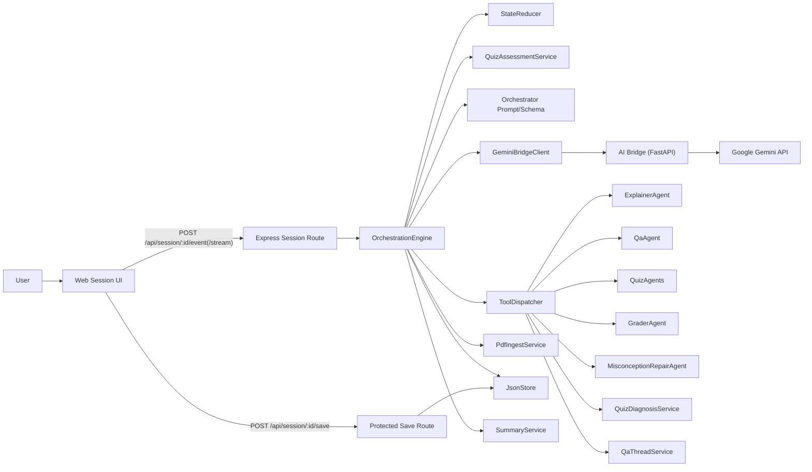
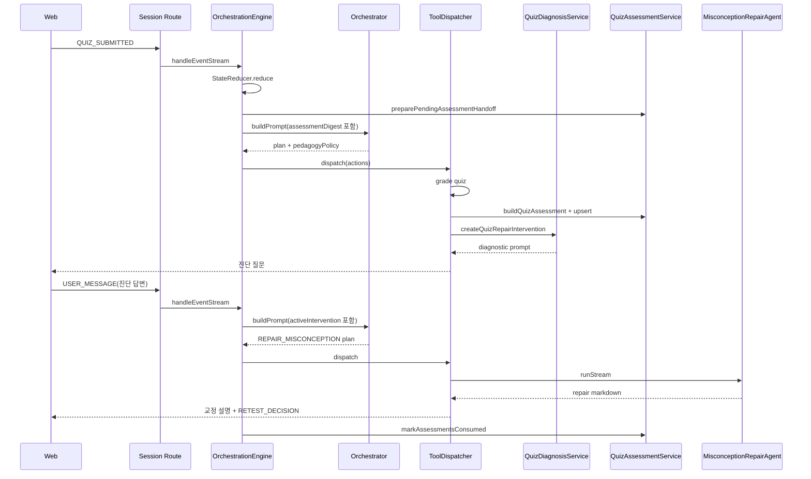

# MergeEduAgent 에이전트 오케스트레이션 상세 설계서 (AS-IS)

- 문서 버전: `v2.2`
- 최종 점검일: `2026-04-16`
- 대상 시스템: `MergeEduAgent`
- 기준 소스: `apps/server/src`, `apps/web/src`, `apps/ai-bridge`

## 1. 목적과 범위

이 문서는 현재 코드베이스에 구현된 세션 오케스트레이션 구조를
`이벤트 수신 -> 상태 선반영 -> assessment handoff 준비 -> LLM 계획 수립 -> verifier 통과 -> 툴 실행 -> 저장`
관점에서 설명한다.

포함 범위:

- `OrchestrationEngine`
- `Orchestrator`
- `StateReducer`
- `ToolDispatcher`
- `QuizAssessmentService`
- `QuizDiagnosisService`
- 서브 에이전트(`ExplainerAgent`, `QaAgent`, `QuizAgents`, `GraderAgent`, `MisconceptionRepairAgent`)
- `GeminiBridgeClient`와 `apps/ai-bridge/main.py`
- 세션 관련 API/스트리밍 계약

제외 범위:

- 학생 역량 리포트 상세 설계
- 대시보드/일반 CRUD UI 스타일링
- 운영 인프라 상세

## 2. 시스템 컨텍스트



핵심 특징:

- 세션 오케스트레이션은 서버에서 중앙집중 수행된다.
- 기본 실행 경로는 `LLM planner`이며, 실패 시 deterministic fallback plan으로 복구한다.
- LLM 출력은 먼저 `pedagogyPolicy`를 정하고, `ToolDispatcher`의 inline verifier가 그 제약을 다시 강제한다.
- 실제 설명/질문/퀴즈/채점/오답 교정 실행은 모두 `ToolDispatcher`가 담당한다.
- 퀴즈 채점 결과는 `quiz.grading`에 더해 `quizAssessments`에도 저장되고, 다음 턴 `assessmentDigest`로 handoff 된다.
- 세션 저장은 서버 상태를 기준으로만 수행되며, `/session/:sessionId/save`는 클라이언트 state를 덮어쓰지 못한다.

## 3. 의존성 조립(Composition Root)

파일:

- `apps/server/src/bootstrap.ts`

조립 순서:

1. `JsonStore.init()`
2. `GeminiBridgeClient`, `PdfIngestService`
3. `ExplainerAgent`, `QaAgent`, `QuizAgents`, `GraderAgent`, `MisconceptionRepairAgent`
4. `StateReducer`, `Orchestrator`, `SummaryService`, `ToolDispatcher`
5. `OrchestrationEngine`

`Orchestrator` 자체는 프롬프트와 fallback plan을 제공하고,
실제 LLM 호출은 `OrchestrationEngine`이 `GeminiBridgeClient`를 통해 수행한다.

## 4. 단일 이벤트 처리 파이프라인

파일:

- `apps/server/src/services/engine/OrchestrationEngine.ts`

현재 구현의 실제 순서는 아래와 같다.

1. `JsonStore.getSession(sessionId)`로 세션을 읽는다.
2. `StateReducer.reduce(...)`로 이벤트의 즉시 상태 변화를 먼저 반영한다.
3. 강의 정보를 읽고 `currentPage`를 강의 페이지 범위로 clamp 한다.
4. `ensurePageState(...)`로 현재 페이지 상태를 보장한다.
5. `SAVE_AND_EXIT`가 아니면 `preparePendingAssessmentHandoff(reduced)`로 아직 소비되지 않은 `quizAssessments`를 골라 `assessmentDigest`를 만든다.
6. `PdfIngestService.readPageContext(...)`로 현재/이전/다음 페이지 텍스트를 읽는다.
7. `planWithLlm(...)`로 오케스트레이터 plan을 만든다.
8. `normalizePlan(...)`으로 `pedagogyPolicy`가 항상 존재하도록 보정한다.
9. plan의 `memoryWrite`가 있으면 `applyLearnerMemoryWrite(...)`로 세션 메모리를 병합한다.
10. plan 안에 퀴즈 생성 tool이 있으면 quiz context를 추가 준비한다.
11. `ToolDispatcher.dispatch(...)`로 tool action을 순차 실행한다.
12. 오케스트레이터 thought summary를 ORCHESTRATOR 메시지에 주입한다.
13. `SummaryService.summarize(...)`로 최근 대화 요약을 다시 만든다.
14. handoff에 사용한 assessment가 있으면 `markAssessmentsConsumed(...)`로 `CONSUMED` 처리한다.
15. 새로 채점된 퀴즈가 있으면 `quiz-results.json` 로그를 append 한다.
16. 최종 세션을 저장하고 `newMessages + ui + patch`를 반환한다.

### 4.1 LLM 계획 수립 경로

`planWithLlm(...)`는 아래 경우에 primary LLM path를 사용한다.

- 이벤트가 `SAVE_AND_EXIT`가 아님
- 강의 PDF에 `geminiFile` 참조가 존재함

실행 방식:

1. `Orchestrator.buildPrompt(...)`
2. `Orchestrator.getResponseJsonSchema()`
3. `GeminiBridgeClient.orchestrateSessionStream(...)`
4. `parseOrchestratorPlan(...)`

오케스트레이터 prompt 입력에는 아래가 함께 들어간다.

- 현재/이전/다음 페이지 텍스트
- 통합 학습 메모리 digest
- 최근 메시지/최근 퀴즈/페이지 이력 digest
- 현재 QA follow-up thread digest
- 현재 `activeIntervention` digest
- 최근 pending `assessmentDigest`

스트리밍 중 `thought` 채널만 `orchestrator_thought_delta`로 UI에 흘려 보낸다.

### 4.2 fallback plan 경로

아래 경우에는 `Orchestrator.fallback(...)`을 사용한다.

- `SAVE_AND_EXIT`
- `geminiFile` 없음
- 브리지/모델 호출 실패
- LLM 응답을 plan schema로 정리하지 못한 경우

이 fallback은 테스트와 장애 복구 시나리오에서 같은 deterministic 기준선으로 활용된다.

## 5. 오케스트레이터 설계

파일:

- `apps/server/src/services/agents/Orchestrator.ts`
- `apps/server/src/types/orchestrator.ts`
- `apps/server/src/types/guards.ts`

### 5.1 역할

현재 구현에서 `Orchestrator`의 역할은 네 가지다.

- tool catalog 정의
- `pedagogyPolicy` 중심의 LLM prompt 작성
- structured plan schema 제공
- deterministic fallback plan 제공

즉, 클래스 안에서 직접 LLM을 호출하지는 않지만,
오케스트레이션 정책의 중심은 여기에 모여 있다.

### 5.2 현재 plan 모델

현재 `OrchestratorPlan`은 아래 구조를 사용한다.

```json
{
  "schemaVersion": "1.0",
  "actions": [
    {
      "type": "CALL_TOOL",
      "tool": "ANSWER_QUESTION",
      "args": {
        "questionText": "왜 이렇게 되나요?",
        "page": 2,
        "threadMode": "FOLLOW_UP"
      }
    }
  ],
  "stop": false,
  "memoryWrite": null,
  "pedagogyPolicy": {
    "mode": "ADVANCE",
    "reason": "근거: 일반 자유 질문; 판단: 일반 QA.",
    "allowDirectAnswer": true,
    "hintDepth": "LOW",
    "interventionBudget": 2
  }
}
```

현재 구현에서 action type은 사실상 `CALL_TOOL`만 사용한다.
과거 설계에 있던 `SEND_MESSAGE`, `SET_UI_STATE` 같은 독립 action type은 현재 없다.

### 5.3 tool catalog

현재 오케스트레이터가 출력할 수 있는 tool은 아래 15개다.

| Tool | 용도 |
|---|---|
| `APPEND_ORCHESTRATOR_MESSAGE` | 단순 안내 메시지 추가 |
| `APPEND_SYSTEM_MESSAGE` | 시스템 메시지 추가 |
| `PROMPT_BINARY_DECISION` | 예/아니오 위젯 메시지 추가 |
| `OPEN_QUIZ_TYPE_PICKER` | 퀴즈 유형 선택 위젯 추가 |
| `SET_CURRENT_PAGE` | 페이지 직접 이동 |
| `EXPLAIN_PAGE` | 설명 에이전트 호출 |
| `ANSWER_QUESTION` | 질문응답 에이전트 호출 |
| `GENERATE_QUIZ_MCQ` | 객관식 퀴즈 생성 |
| `GENERATE_QUIZ_OX` | OX 퀴즈 생성 |
| `GENERATE_QUIZ_SHORT` | 단답형 퀴즈 생성 |
| `GENERATE_QUIZ_ESSAY` | 서술형 퀴즈 생성 |
| `AUTO_GRADE_MCQ_OX` | MCQ/OX 자동 채점 |
| `GRADE_SHORT_OR_ESSAY` | SHORT/ESSAY LLM 채점 |
| `REPAIR_MISCONCEPTION` | 오답 원인 교정 설명 호출 |
| `WRITE_FEEDBACK_ENTRY` | 내부 진행 로그 추가 |

### 5.4 prompt 입력과 정책 helper

현재 프롬프트와 fallback plan은 아래 helper와 digest에 크게 의존한다.

- `recentScoreStats(...)`
  - 최근 4개 채점 퀴즈의 평균/마지막 점수 계산
- `isCorePage(...)`
  - 키워드, 수식, 페이지 텍스트 길이 기반 핵심 페이지 추정
- `recommendQuizType(...)`
  - 메모 선호 퀴즈 또는 학습자 레벨 기반 추천
- `recommendedDetailLevel(...)`
  - 저성취, 약점 메모, 목표 난이도 기반 설명 깊이 추천
- `buildQaThreadDigest(...)`
  - 같은 페이지 follow-up 질문 문맥 압축
- `buildActiveInterventionDigest(...)`
  - 현재 오답 교정 단계 요약
- `recentMessagesDigest(...)`, `recentQuizDigest(...)`, `buildPageHistoryDigest(...)`
  - 프롬프트 압축용 최근 기록 요약

또한 현재 prompt에는 아래 운영 규칙이 들어간다.

- `pedagogyPolicy`를 먼저 정하고 tool을 고른다.
- `assessmentDigest`는 지시문이 아니라 구조화된 관찰 메모로 취급한다.
- 단일 assessment 하나만으로 `learnerLevel` 또는 `confidence`를 바꾸지 않는다.
- `allowDirectAnswer=false`인 QA 턴은 힌트형 답변으로 제한한다.
- `interventionBudget`과 verifier 하드캡을 넘지 않게 action 수를 제한한다.

### 5.5 현재 fallback 분기 요약

- `SESSION_ENTERED`
  - `START_EXPLANATION_DECISION` 위젯
- `START_EXPLANATION_DECISION`
  - 수락 시 설명 시작
- `USER_MESSAGE`
  - next/prev 명령, 자유 질문, QA follow-up, 자율 시도 신호 분기
- `PAGE_CHANGED`
  - 새 페이지 설명 시작
- `QUIZ_DECISION`
  - 퀴즈 유형 선택 또는 다음 페이지 여부
- `QUIZ_TYPE_SELECTED`
  - 유형별 `GENERATE_QUIZ_*`
- `QUIZ_SUBMITTED`
  - 객관식/OX 자동 채점 또는 SHORT/ESSAY 채점
- `activeIntervention.stage === AWAITING_DIAGNOSIS_REPLY` + `USER_MESSAGE`
  - `REPAIR_MISCONCEPTION`
- `REVIEW_DECISION`
  - 상세 복습 설명 후 재시험 여부 질문
- `RETEST_DECISION`
  - 재시험 유형 선택 또는 종료
- `SAVE_AND_EXIT`
  - 저장 메시지

## 6. ToolDispatcher 설계

파일:

- `apps/server/src/services/engine/ToolDispatcher.ts`

`ToolDispatcher`는 plan을 실제 런타임 부수효과로 바꾸는 실행기다.

### 6.1 verifier layer

`ToolDispatcher`는 dispatch 전에 inline verifier를 적용한다.

주요 역할:

- `pedagogyPolicy`와 실제 actions의 일관성 검사
- 누락된 최소 정책 보정
- `MISCONCEPTION_REPAIR` 모드일 때 `REPAIR_MISCONCEPTION` 자동 주입
- `HOLD_BACK`, `MINIMAL_HINT`, `CHECK_READINESS` 같은 정책별 tool 제한
- `interventionBudget`와 전체 action 하드캡 적용
- `[verifier]` 로그 출력

즉, plan 안전성은 `Orchestrator prompt 제약 + ToolDispatcher verifier` 이중 방어로 유지된다.

### 6.2 AI tool 실행 전 공통 처리

- 대상 lecture의 `geminiFile`이 없으면 AI tool 대신 SYSTEM 메시지를 추가한다.
- 실행 대상 page가 base page와 다르면 `resolvePageContext(...)`로 해당 페이지 컨텍스트를 다시 읽는다.
- `buildIntegratedMemoryDigest(state)`를 모든 AI 하위 agent 입력에 전달한다.
- QA는 필요 시 `buildQaThreadDigest(state, page)`를 추가로 전달한다.

### 6.3 EXPLAIN_PAGE

실행 흐름:

1. `ExplainerAgent.runStream(...)`
2. `pageState.status = "EXPLAINED"`
3. `pageState.explainSummary`, `pageState.explainMarkdown` 저장
4. EXPLAINER 메시지 추가

### 6.4 ANSWER_QUESTION

실행 흐름:

1. `threadMode`를 `START_NEW` 또는 `FOLLOW_UP`으로 결정
2. follow-up이면 `buildQaThreadDigest(...)`를 QA agent에 전달
3. `QaAgent.runStream(...)`
4. QA 메시지 추가
5. `appendQaThreadTurn(...)`으로 현재 페이지의 QA 문맥 갱신

### 6.5 GENERATE_QUIZ_*

실행 흐름:

1. `QuizAgents.runStream(...)`
2. 새 `QuizRecord`를 `state.quizzes`에 push
3. `pageState.status = "QUIZ_IN_PROGRESS"`
4. 퀴즈 모달 open
5. QUIZ 메시지 추가

현재 quiz agent 입력은 다음 특징을 가진다.

- 범위: `coverageStartPage = 1`, `coverageEndPage = currentPage`
- 텍스트:
  - 우선 `buildPageHistoryDigest(...)`
  - 없으면 PDF 누적 본문(`readCumulativeContext(...)`)
- 학생 상태:
  - `learnerLevel`
  - `learnerMemoryDigest`
  - `targetDifficulty`

### 6.6 AUTO_GRADE_MCQ_OX

- 서버 내부 정답 비교로 채점
- OX는 공백/미응답을 `미응답입니다.`로 처리한다.
- `pageState.status = "QUIZ_GRADED"`
- `bestScoreRatio` 갱신
- GRADER 메시지 추가
- 채점 직후 `buildQuizAssessment(...)`와 `upsertQuizAssessment(...)`로 `QuizAssessmentRecord` 저장
- assessment 생성 실패는 `[assessment_error]`만 남기고 채점/repair 흐름은 계속 진행
- 기준 점수 미달이면 `QuizDiagnosisService` 기반 `activeIntervention`을 만들고 진단 질문을 보낸다.
- intervention을 못 만들면 fallback으로 `REVIEW_DECISION` 위젯 메시지를 추가한다.

### 6.7 GRADE_SHORT_OR_ESSAY

- `GraderAgent.gradeStream(...)` 호출
- grading 결과를 `quizRecord.grading`에 저장
- `pageState.status = "QUIZ_GRADED"`
- assessment 저장 흐름은 `AUTO_GRADE_MCQ_OX`와 동일하게 수행
- 기준 점수 미달이면 `activeIntervention` 생성 또는 `REVIEW_DECISION` fallback

`QuizAssessmentRecord`에는 아래가 들어간다.

- `deliveryStatus`, `consumedAt`
- `readiness`
- `strengths`, `weaknesses`, `misconceptions`
- `behaviorSignals`
- `memoryHint`
- `summaryMarkdown`
- `evidence`

### 6.8 REPAIR_MISCONCEPTION

실행 흐름:

1. `activeIntervention.stage === AWAITING_DIAGNOSIS_REPLY`인지 확인
2. `buildRepairQuestion(...)`으로 학생 답변을 교정 입력으로 정리
3. `MisconceptionRepairAgent.runStream(...)`
4. EXPLAINER 메시지 추가
5. `buildRepairMemoryWrite(...)`로 메모리 보강
6. `activeIntervention.stage = REPAIR_DELIVERED`
7. `pageState.status = "REVIEW_DONE"`
8. 피드백 로그 추가
9. `RETEST_DECISION` 위젯 메시지 추가

### 6.9 WRITE_FEEDBACK_ENTRY

- `state.feedback`에 짧은 진행 로그 추가
- 학습자 레벨과 현재 진도 텍스트도 함께 저장

### 6.10 예외 처리

tool 하나가 실패해도 전체 요청을 중단하지 않는다.
현재 구현은 다음 방식으로 soft-failure 한다.

- 실패 tool 이름 포함
- SYSTEM 메시지 append
- 나머지 tool 실행은 계속 진행

assessment 생성 오류도 같은 철학을 따른다.
즉, assessment가 실패해도 grading과 repair 판단은 계속 진행된다.

## 7. 서브 에이전트 설계

공통 패턴:

- 입력 DTO 수신
- `GeminiBridgeClient` 스트림 호출
- 최종 markdown/JSON 정규화
- `thoughtSummary` 반환

### 7.1 ExplainerAgent

- 파일: `apps/server/src/services/agents/ExplainerAgent.ts`
- 브리지: `explainPageStream`
- 입력: page text, neighbor text, detailLevel, learnerLevel, learnerMemoryDigest

### 7.2 QaAgent

- 파일: `apps/server/src/services/agents/QaAgent.ts`
- 브리지: `answerQuestionStream`
- 입력: question, page text, neighbor text, learnerLevel, learnerMemoryDigest, qaThreadDigest

### 7.3 QuizAgents

- 파일: `apps/server/src/services/agents/QuizAgents.ts`
- 브리지: `generateQuizStream`
- 특징:
  - `parseQuizJson(...)` 검증
  - `normalizeQuiz(...)` 정규화
  - question count는 현재 3개 고정

### 7.4 GraderAgent

- 파일: `apps/server/src/services/agents/GraderAgent.ts`
- 브리지: `gradeQuizStream`
- 특징:
  - `parseGrading(...)` 검증

### 7.5 MisconceptionRepairAgent

- 파일: `apps/server/src/services/agents/MisconceptionRepairAgent.ts`
- 브리지: 기존 설명/QA 계열 입력을 교정 지향 래퍼로 감싼 호출
- 특징:
  - 진단 질문에 대한 학생 답변을 받아 짧은 오개념 교정 설명 생성
  - 전체 재설명보다 `focusConcepts`와 `suspectedMisconceptions`를 우선 반영

## 8. 상태 모델

핵심 타입 파일:

- `apps/server/src/types/domain.ts`

주요 상태:

- `SessionState`
- `PageState`
- `QuizRecord`
- `IntegratedLearnerMemory`
- `QuizAssessmentRecord`
- `ActiveIntervention`
- `QaThreadMemory`
- `LearnerModel`
- `Widget`
- `AppEvent`

### 8.1 StateReducer 책임

`StateReducer`는 이벤트 직후 필요한 상태만 먼저 선반영한다.

예:

- user message append
- next 명령 감지 시 `currentPage += 1`
- `PAGE_CHANGED` 반영
- `QUIZ_DECISION`, `QUIZ_TYPE_SELECTED`, `REVIEW_DECISION`에 따른 기본 page status 변경
- 페이지 전환 시 QA thread reset
- 필요 시 `activeIntervention` 종료

### 8.2 SessionState 추가 레이어

현재 세션에는 아래 세 가지 런타임 레이어가 함께 저장된다.

- `activeIntervention`
  - 현재 오답 교정 흐름이 열려 있는지, 어느 단계인지 추적
- `qaThread`
  - 같은 페이지 follow-up 질문응답만 최대 6턴까지 유지
- `quizAssessments`
  - 채점 결과에서 파생된 deterministic assessment artifact 저장

`JsonStore`는 구버전 세션을 로드할 때 아래를 backfill 한다.

- `integratedMemory`
- `qaThread`
- `activeIntervention`
- `quizAssessments`

### 8.3 PageStatus 주의점

정의된 enum:

`NEW`, `EXPLAINING`, `EXPLAINED`, `QUIZ_TYPE_PENDING`, `QUIZ_IN_PROGRESS`, `QUIZ_GRADED`, `REVIEW_IN_PROGRESS`, `REVIEW_DONE`, `DONE`

현재 구현상 특징:

- `REVIEW_IN_PROGRESS`는 진단/교정 대기 구간에서 실제로 사용된다.
- `REVIEW_DONE`는 `REPAIR_MISCONCEPTION` 완료 시 set 된다.
- 동일 페이지에 재진입하거나 재설명할 수 있다.

### 8.4 assessment lifecycle

현재 `quizAssessments`의 라이프사이클은 아래와 같다.

1. grading 직후 `PENDING`으로 생성
2. 다음 orchestration turn에서 `preparePendingAssessmentHandoff(...)`가 선택
3. prompt에 `assessmentDigest`로 전달
4. turn 저장 직전 `markAssessmentsConsumed(...)`
5. `deliveryStatus = CONSUMED`

즉, assessment는 same-turn memory write가 아니라
다음 턴 personalization 후보를 위한 세션 artifact다.

## 9. 세션 시퀀스 예시



## 10. AI Bridge와 Gemini 연동

서버 클라이언트 파일:

- `apps/server/src/services/llm/GeminiBridgeClient.ts`

브리지 파일:

- `apps/ai-bridge/main.py`

현재 세션 플로우에서 실제로 쓰는 브리지 endpoint:

- `/bridge/upload_pdf`
- `/bridge/explain_page_stream`
- `/bridge/answer_question_stream`
- `/bridge/generate_quiz_stream`
- `/bridge/grade_quiz_stream`
- `/bridge/orchestrate_session_stream`

### 10.1 NDJSON 스트림 계약

브리지 내부 스트림은 기본적으로 아래 이벤트를 쓴다.

- `thought_delta`
- `answer_delta`
- `done`
- `error`

서버는 이를 다시 세션 전용 이벤트로 변환한다.

- `orchestrator_thought_delta`
- `agent_delta`
- `final`
- `error`

### 10.2 Gemini 기능 사용

현재 구현은 다음 기능을 실제 사용한다.

- `thinking_config.include_thoughts = true`
- `response_mime_type = "application/json"`
- `response_json_schema = <plan schema>`
- `cached_content = <uploaded PDF cache>`

`cached_content`는 브리지에서 PDF 파일 기준으로 캐시를 만들 수 있을 때 사용한다.

## 11. API 및 프론트 계약

세션 라우트 파일:

- `apps/server/src/routes/session.ts`

핵심 endpoint:

- `GET /api/session/by-lecture/:lectureId`
  - 세션 조회/생성
  - `geminiFile` 누락 시 PDF 재업로드 복구 시도
- `POST /api/session/:sessionId/save`
  - `buildProtectedSessionSaveState(...)`를 통해 서버 상태만 다시 저장
  - 클라이언트가 보낸 `state`는 경고 로그만 남기고 무시
- `POST /api/session/:sessionId/event`
  - 단건 이벤트 처리
- `POST /api/session/:sessionId/event/stream`
  - NDJSON 스트리밍 처리

프론트 계약 파일:

- `apps/web/src/api/endpoints.ts`
- `apps/web/src/routes/Session.tsx`

현재 UI가 받는 세션 스트림 이벤트:

- `orchestrator_thought_delta`
- `agent_delta`
- `error`

최종 결과는 `final`에서 세션 patch와 새 메시지를 받는다.

## 12. 예외와 복구

현재 구현의 주요 복구 전략은 아래와 같다.

- `geminiFile` 누락
  - 세션 진입 시 PDF 재업로드 복구 시도
- tool 실행 실패
  - SYSTEM 메시지로 degrade
- 브리지/모델 실패
  - fallback plan으로 전환
- assessment 생성 실패
  - grading/repair 흐름은 유지하고 warning log만 남김
- 세션 없는 경우
  - `Session not found` 오류
- lecture 없는 경우
  - `Lecture not found for session` 오류
- 저장 일관성
  - `JsonStore`는 `.tmp -> rename` 방식으로 atomic write

## 13. 테스트 근거

관련 테스트 파일:

- `apps/server/src/tests/orchestratorFlow.test.ts`
- `apps/server/src/tests/orchestratorPrompt.test.ts`
- `apps/server/src/tests/orchestrationEngine.test.ts`
- `apps/server/src/tests/stateReducer.test.ts`
- `apps/server/src/tests/toolDispatcher.test.ts`
- `apps/server/src/tests/quizAssessmentService.test.ts`
- `apps/server/src/tests/sessionRoute.test.ts`
- `apps/server/src/tests/jsonStore.test.ts`
- `apps/server/src/tests/schema.test.ts`

검증 포인트:

- 주요 이벤트 분기
- `pedagogyPolicy` + verifier 일관성
- QA follow-up thread 처리
- low-score diagnosis / misconception repair
- assessment 생성 / handoff / consumed marking
- save route 보호
- tool soft-failure
- schema parsing

## 14. 결론

현재 MergeEduAgent의 세션 오케스트레이션은 다음 구조로 정리된다.

- `StateReducer`가 이벤트의 즉시 상태를 선반영한다.
- `Orchestrator`가 prompt, policy, schema, fallback을 제공한다.
- `OrchestrationEngine`이 assessment handoff, LLM planner 호출, 저장 파이프라인을 총괄한다.
- `ToolDispatcher`가 verifier와 실행 부수효과를 담당한다.
- 하위 AI agent는 설명/질문/퀴즈/채점/교정 전용 역할로 제한된다.

즉, 현재 구현의 핵심은
`LLM planner + pedagogy verifier + diagnosis/repair loop + assessment handoff + JSON persistence`
조합으로 보는 것이 가장 정확하다.
