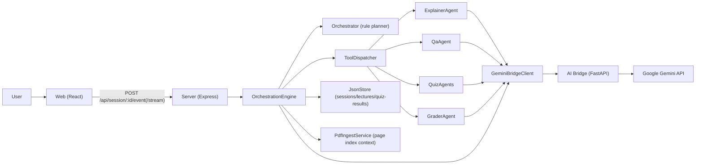
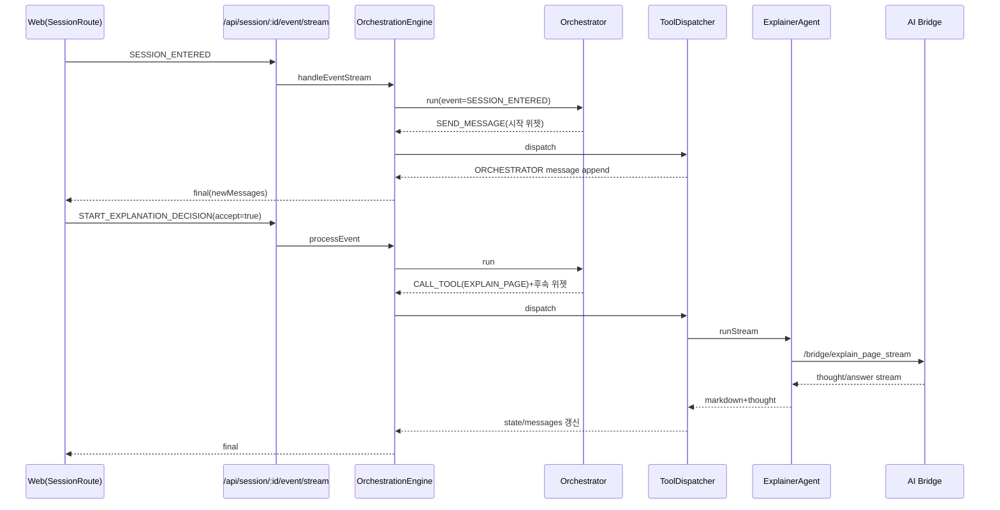
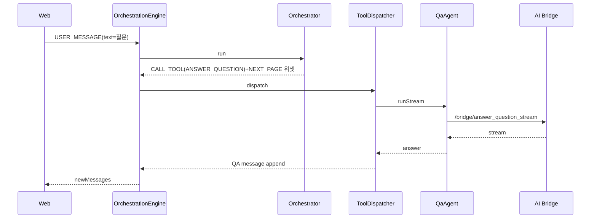
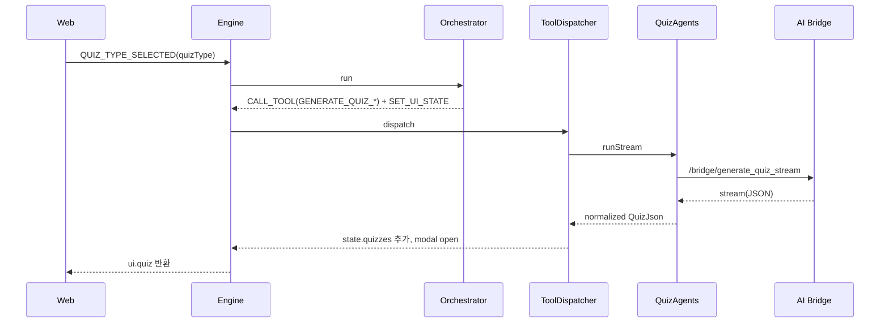

# MergeEduAgent 에이전트 오케스트레이션 상세 설계서 (AS-IS)

- 문서 버전: `v1.0`
- 작성일: `2026-03-08`
- 대상 시스템: `MergeEduAgent` (현재 구현 기준)
- 범위: 오케스트레이터/서브 에이전트의 파일 구성, 호출 구조, 시나리오별 실행 흐름

## 1. 목적 및 범위

### 1.1 목적
본 문서는 현재 코드베이스에 구현된 멀티 에이전트 오케스트레이션 구조를 소프트웨어 설계 문서 표준(목적-범위-아키텍처-컴포넌트-데이터-시퀀스-예외처리-확장포인트) 형식으로 명시한다.

### 1.2 범위
- 포함
  - 서버 오케스트레이션 엔진
  - Orchestrator 계획 수립 로직
  - 서브 에이전트(Explainer/QA/Quiz/Grader)
  - ToolDispatcher 실행 로직
  - 이벤트/상태 전이
  - 프론트엔드 이벤트 트리거와 API 호출 방식
  - AI Bridge(FastAPI) 연동 경로
- 제외
  - UI 스타일링 상세
  - 운영 인프라(K8s, CI/CD) 상세
  - 미래 요구사항(미구현 기능)

### 1.3 기준
- 본 문서는 `apps/server/src`, `apps/web/src`, `apps/ai-bridge`의 **현재 소스코드**를 기준으로 작성한다.

---

## 2. 시스템 컨텍스트

핵심 특징:
- 오케스트레이션은 **서버**에서 중앙집중 수행.
- 오케스트레이터는 우선 **규칙 기반(plan 생성)**이며, 일부 이벤트에서만 LLM 힌트를 사용.
- 서브 에이전트는 모두 `GeminiBridgeClient`를 통해 AI Bridge로 위임.
- 실행 결과는 세션 JSON 파일로 영속화.

---

## 3. 런타임 아키텍처 및 책임 분해

## 3.1 의존성 조립(Composition Root)
- 파일: `apps/server/src/bootstrap.ts`
- 조립 순서:
  1. `JsonStore.init()`
  2. `GeminiBridgeClient`, `PdfIngestService` 생성
  3. 에이전트 생성(`ExplainerAgent`, `QaAgent`, `QuizAgents`, `GraderAgent`)
  4. `StateReducer`, `Orchestrator`, `SummaryService`, `ToolDispatcher` 생성
  5. `OrchestrationEngine` 생성

## 3.2 API 진입점
- 파일: `apps/server/src/routes/session.ts`
- 주요 엔드포인트:
  - `GET /api/session/by-lecture/:lectureId`
    - 세션 조회/생성
    - lecture에 `geminiFile`이 없으면 PDF 재업로드 시도
  - `POST /api/session/:sessionId/event`
    - 단건 이벤트 처리(비스트리밍)
  - `POST /api/session/:sessionId/event/stream`
    - NDJSON 스트리밍 이벤트 처리

## 3.3 핵심 엔진
- 파일: `apps/server/src/services/engine/OrchestrationEngine.ts`
- 처리 파이프라인(단일 이벤트):
  1. 세션 로드
  2. `StateReducer.reduce(...)` 선반영
  3. 강의/페이지 컨텍스트 로드 (`PdfIngestService.readPageContext`)
  4. (조건부) 오케스트레이터 사고 스트림 + 힌트 생성
  5. `Orchestrator.run(...)`으로 액션 플랜 생성
  6. `parseOrchestratorPlan(...)` 스키마 검증
  7. `ToolDispatcher.dispatch(...)`로 액션 실행
  8. 대화 요약/퀴즈 로그/세션 저장
  9. `patch + ui + newMessages` 응답

---

## 4. 오케스트레이터 설계

## 4.1 구현 파일
- `apps/server/src/services/agents/Orchestrator.ts`

## 4.2 역할
- 입력 이벤트(`AppEvent`)와 현재 상태를 바탕으로 **실행 가능한 액션 목록**(`OrchestratorPlan.actions`)을 생성한다.
- 실제 AI 호출은 하지 않고, 도구 호출(`CALL_TOOL`)만 선언한다.

## 4.3 액션 타입
- `SEND_MESSAGE`
- `CALL_TOOL`
- `SET_UI_STATE`

## 4.4 이벤트-분기 요약
- `SESSION_ENTERED`
  - 시작 안내 + `START_EXPLANATION_DECISION` 위젯
- `START_EXPLANATION_DECISION`
  - 수락 시 `EXPLAIN_PAGE` + (조건부) 퀴즈 여부 질문
- `PAGE_CHANGED`
  - 새 페이지 설명 시작 + 후속 분기
- `USER_MESSAGE`
  - 다음 페이지 명령 감지 시 페이지 진행 플로우
  - 퀴즈 의도 감지 시 `QUIZ_TYPE_PICKER`
  - 일반 질문은 `ANSWER_QUESTION`
- `QUIZ_DECISION`
  - 수락: 퀴즈 유형 선택 / 거절: 다음 페이지 여부
- `QUIZ_TYPE_SELECTED`
  - 선택 유형에 따라 `GENERATE_QUIZ_*`
- `QUIZ_SUBMITTED`
  - MCQ/OX: `AUTO_GRADE_MCQ_OX`
  - SHORT/ESSAY: `GRADE_SHORT_OR_ESSAY`
- `REVIEW_DECISION`, `RETEST_DECISION`
  - 복습/재시험 루프
- `SAVE_AND_EXIT`
  - 저장 완료 메시지

## 4.5 내부 정책 함수
- `shouldUseDetailedExplanation(...)`
  - 저성취/약점개념/LLM 힌트 기반 설명 깊이 조정
- `shouldOfferQuiz(...)`
  - 핵심 페이지, 최근 점수, 시도 횟수, 힌트 기반 퀴즈 제안 여부 결정
- `recommendQuizType(...)`
  - 학습자 레벨 기반 추천(BEGINNER→OX, ADVANCED→SHORT, 기본→MCQ)

---

## 5. 서브 에이전트 설계

서브 에이전트는 공통적으로 다음 패턴을 따른다.
- 입력 DTO 수신
- `GeminiBridgeClient` 스트리밍 API 호출
- 결과 정규화/파싱
- markdown + thoughtSummary 반환

## 5.1 ExplainerAgent
- 파일: `apps/server/src/services/agents/ExplainerAgent.ts`
- 호출 브리지: `explainPageStream`
- 출력: 페이지 설명 Markdown, 사고 요약

## 5.2 QaAgent
- 파일: `apps/server/src/services/agents/QaAgent.ts`
- 호출 브리지: `answerQuestionStream`
- 출력: 질의응답 Markdown, 사고 요약

## 5.3 QuizAgents
- 파일: `apps/server/src/services/agents/QuizAgents.ts`
- 호출 브리지: `generateQuizStream`
- 특징:
  - `parseQuizJson`으로 스키마 검증
  - 문항/선택지/정답 필드 정규화 (`normalizeQuiz`, `normalizeQuestion`)

## 5.4 GraderAgent
- 파일: `apps/server/src/services/agents/GraderAgent.ts`
- 호출 브리지: `gradeQuizStream`
- 특징:
  - `parseGrading`으로 채점 JSON 검증

---

## 6. ToolDispatcher 설계 (오케스트레이터-서브에이전트 연결부)

- 파일: `apps/server/src/services/engine/ToolDispatcher.ts`

| Tool | 실행 주체 | 주요 부수효과 |
|---|---|---|
| `EXPLAIN_PAGE` | ExplainerAgent | `pageState.status=EXPLAINED`, 설명 저장, EXPLAINER 메시지 추가 |
| `ANSWER_QUESTION` | QaAgent | QA 메시지 추가 |
| `GENERATE_QUIZ_*` | QuizAgents | `state.quizzes` 추가, `QUIZ_IN_PROGRESS`, 퀴즈 모달 open |
| `AUTO_GRADE_MCQ_OX` | 내부 로직 | 정답 비교 채점, `QUIZ_GRADED`, 기준 미달 시 복습 위젯 |
| `GRADE_SHORT_OR_ESSAY` | GraderAgent | LLM 채점 반영, 기준 미달 시 복습 위젯 |
| `WRITE_FEEDBACK_ENTRY` | 내부 로직 | `state.feedback` 추가 |

오류 처리:
- 도구 실행 예외 시 요청 전체 중단 대신 `SYSTEM` 메시지(`AI 도구 실행 실패(...)`)를 append하여 흐름을 유지한다.

---

## 7. 상태 모델 설계

## 7.1 핵심 상태 객체
- 파일: `apps/server/src/types/domain.ts`
- 주요 타입:
  - `SessionState`
  - `PageState`
  - `QuizRecord`
  - `LearnerModel`
  - `AppEvent`

## 7.2 PageStatus
`NEW → EXPLAINING → EXPLAINED → QUIZ_TYPE_PENDING → QUIZ_IN_PROGRESS → QUIZ_GRADED → REVIEW_IN_PROGRESS → DONE`

(구현상 이벤트에 따라 일부 상태는 건너뛰거나 재진입 가능)

## 7.3 상태 전이 책임 분리
- `StateReducer`: 이벤트 도착 즉시 선반영(페이지 이동/유저 메시지/기본 상태)
- `ToolDispatcher`: 실제 도구 실행 결과 반영(설명 완료, 퀴즈 생성/채점 결과)

---

## 8. 시나리오별 호출 시퀀스

## 8.1 세션 진입 → 설명 시작

## 8.2 자유 질문(USER_MESSAGE) → QA

## 8.3 퀴즈 생성 (유형 선택)

## 8.4 퀴즈 제출/채점

- MCQ/OX: 오케스트레이터가 `AUTO_GRADE_MCQ_OX` 호출, 서버 내부 정답 비교 채점
- SHORT/ESSAY: `GRADE_SHORT_OR_ESSAY` 호출, GraderAgent가 LLM 채점

기준 점수 미달(`passScoreRatio`) 시 공통적으로 `REVIEW_DECISION` 위젯 메시지가 추가된다.

## 8.5 다음 페이지 이동
- 트리거
  - PDF 뷰어 페이지 변경 (`PAGE_CHANGED`)
  - 사용자 텍스트에서 next 명령 감지 (`USER_MESSAGE` 내부)
  - `NEXT_PAGE_DECISION(accept=true)`
- 공통 결과
  - `currentPage` 변경
  - 해당 페이지 설명/퀴즈 후속 플로우 재시작

## 8.6 복습/재시험 루프
- `REVIEW_DECISION(accept=true)`
  - `EXPLAIN_PAGE(detail=DETAILED)` 후 `RETEST_DECISION` 질문
- `RETEST_DECISION(accept=true)`
  - 퀴즈 유형 선택 재진입

---

## 9. LLM 브리지 설계

## 9.1 서버 측 브리지 클라이언트
- 파일: `apps/server/src/services/llm/GeminiBridgeClient.ts`
- 역할:
  - HTTP/NDJSON 스트림 래핑
  - 오류 메시지 표준화(`AI <action> 실패: ...`)
  - thought/answer 채널 분리

## 9.2 Python AI Bridge
- 파일: `apps/ai-bridge/main.py`
- 역할:
  - FastAPI endpoint 제공
  - Gemini SDK 호출
  - 스트리밍 시 `thought_delta`, `answer_delta`, `done` NDJSON 출력
  - 퀴즈/채점은 answer 텍스트에서 JSON 추출 후 `data`로 재포장

## 9.3 오케스트레이터 사고 스트림
- 엔진이 일부 이벤트에서 `/bridge/orchestrator_thought_stream` 호출
- 결과 JSON(`offerQuiz`, `detailLevel`, `reason`)을 힌트로 파싱하여 Orchestrator 정책에 반영
- 실패 시 규칙 기반 fallback 사고 요약으로 대체

---

## 10. 파일 구성 맵 (오케스트레이터/서브 에이전트 중심)

## 10.1 오케스트레이션 코어
- `apps/server/src/services/engine/OrchestrationEngine.ts`
- `apps/server/src/services/engine/StateReducer.ts`
- `apps/server/src/services/engine/ToolDispatcher.ts`
- `apps/server/src/services/engine/SummaryService.ts`
- `apps/server/src/services/engine/utils.ts`

## 10.2 계획 수립(Orchestrator)
- `apps/server/src/services/agents/Orchestrator.ts`
- `apps/server/src/types/orchestrator.ts`
- `apps/server/src/types/guards.ts`
- `apps/server/src/services/llm/JsonSchemaGuards.ts`

## 10.3 서브 에이전트
- `apps/server/src/services/agents/ExplainerAgent.ts`
- `apps/server/src/services/agents/QaAgent.ts`
- `apps/server/src/services/agents/QuizAgents.ts`
- `apps/server/src/services/agents/GraderAgent.ts`

## 10.4 브리지/저장소/컨텍스트
- `apps/server/src/services/llm/GeminiBridgeClient.ts`
- `apps/ai-bridge/main.py`
- `apps/server/src/services/pdf/PdfIngestService.ts`
- `apps/server/src/services/storage/JsonStore.ts`
- `apps/server/src/routes/session.ts`

## 10.5 프론트 이벤트 발생 지점
- `apps/web/src/routes/Session.tsx`
- `apps/web/src/components/chat/ChatBubble.tsx`
- `apps/web/src/components/quiz/QuizModal.tsx`
- `apps/web/src/api/endpoints.ts`

---

## 11. 예외/복구 설계

- API/도구 실패
  - Express 공통 에러 핸들러가 `{ ok:false, error, code }` 반환
  - ToolDispatcher는 도구 실패 시 SYSTEM 메시지로 degrade
- AI 연결 끊김
  - `GET /session/by-lecture/:lectureId`에서 `geminiFile` 누락 시 재업로드 복구 시도
  - 실패 시 `aiStatus.connected=false`를 UI에 전달
- 스트림 실패
  - NDJSON에 `type:error` 전송 후 클라이언트 예외 처리
- 데이터 일관성
  - `JsonStore`는 atomic write(`.tmp` 후 rename)

---

## 12. 검증 근거(테스트)

- `apps/server/src/tests/orchestratorFlow.test.ts`
  - 주요 이벤트 분기/플랜 생성 검증
- `apps/server/src/tests/stateReducer.test.ts`
  - 페이지/메시지 상태 전이 검증
- `apps/server/src/tests/toolDispatcher.test.ts`
  - 도구 실패 시 soft-failure(흐름 유지) 검증

---

## 13. 확장 포인트

1. 신규 서브 에이전트 추가
- `types/orchestrator.ts` ToolName 추가
- `Orchestrator` 분기 추가
- `ToolDispatcher.executeTool` 케이스 추가
- 필요 시 bridge endpoint 추가

2. 정책 고도화
- `Orchestrator`의 `shouldOfferQuiz`, `shouldUseDetailedExplanation`를 정책 모듈로 분리 가능

3. 상태 머신 강화
- `PageStatus` 전이를 명시적 표/검증기로 강제 가능

4. 저장소 교체
- `JsonStore`를 DB 저장소로 교체해도 엔진 인터페이스는 유지 가능

---

## 14. 결론

현재 구현은 다음의 구조적 성격을 가진다.
- **Rule-based Orchestrator + ToolDispatcher 기반의 명확한 책임 분리**
- **LLM은 실행 도구(설명/질의응답/퀴즈/채점)와 보조 힌트(오케스트레이터 생각)로 제한**
- **이벤트 기반 상태 전이 + 스트리밍 UI 반영 + JSON 파일 영속화**

즉, 에이전트 오케스트레이션의 골격(계획/실행/상태/저장/스트림)이 이미 분리되어 있어, 기능 확장 시 변경 지점이 비교적 명확한 설계이다.
