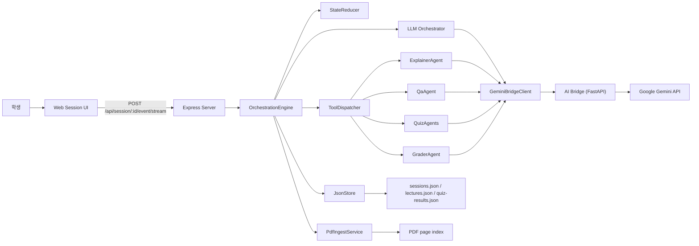
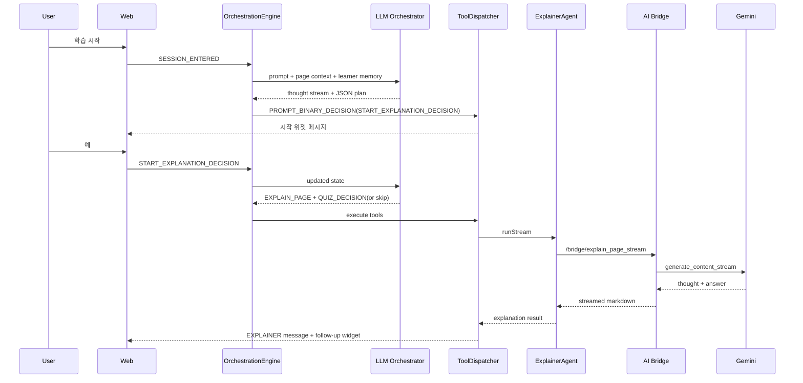
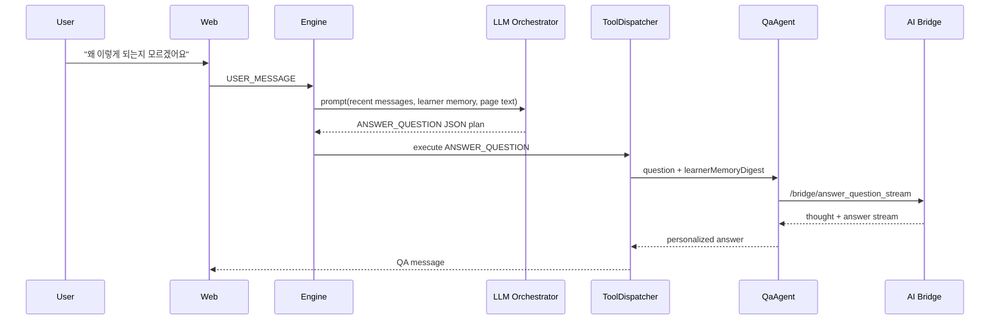
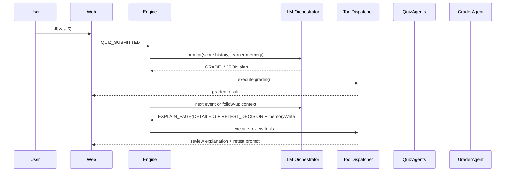

# MergeEduAgent LLM 멀티 에이전트 아키텍처

- 문서 버전: `v2.0`
- 작성일: `2026-03-29`
- 상태: `구현 반영본`
- 범위: `LLM 오케스트레이터`, `통합 학습자 메모리`, `개인화 설명/시험`, `툴 매핑`, `토큰 최적화`, `주요 유스케이스`

## 1. 목표

이번 구조의 핵심은 규칙 기반 오케스트레이터를 `LLM planner`로 치환하고, 다음 판단을 모두 LLM이 `JSON tool plan`으로 선택하도록 만드는 것이다.

- 설명 시작/보류
- 질문 응답
- 페이지 이동
- 퀴즈 생성
- 채점
- 복습/재시험
- 학생 개인화 메모리 갱신

추가 목표는 다음과 같다.

- 설명 에이전트와 시험 에이전트가 학생별 강점/약점/오개념/선호 난이도를 공유하도록 한다.
- Gemini의 `response_json_schema`와 `response_mime_type=application/json`을 이용해 오케스트레이터 출력을 강제한다.
- 오케스트레이터의 사고 요약은 스트리밍으로 보여주되, 실행은 구조화된 JSON plan으로 안정화한다.
- PDF와 반복 컨텍스트는 `cached_content`를 활용해 토큰 비용을 절약한다.
- 세션이 길어져도 전체 PDF를 반복 전송하지 않고, 페이지 이력 요약과 통합 메모리로 컨텍스트를 압축한다.

## 2. 시스템 컨텍스트



## 3. 핵심 설계 요약

### 3.1 LLM 오케스트레이터

오케스트레이터는 더 이상 직접 분기 로직을 확정하지 않고, 현재 이벤트와 학습 상태를 바탕으로 아래 형식의 `plan JSON`만 생성한다.

```json
{
  "schemaVersion": "1.0",
  "actions": [
    {
      "type": "CALL_TOOL",
      "tool": "EXPLAIN_PAGE",
      "args": {
        "page": 3,
        "detailLevel": "DETAILED"
      }
    },
    {
      "type": "CALL_TOOL",
      "tool": "PROMPT_BINARY_DECISION",
      "args": {
        "contentMarkdown": "현재 페이지 설명이 끝났습니다. 퀴즈를 진행할까요?",
        "decisionType": "QUIZ_DECISION"
      }
    }
  ],
  "memoryWrite": {
    "shouldPersist": true,
    "weaknesses": ["정의와 예시를 연결하는 데 약함"],
    "explanationPreferences": ["예시 중심 설명 선호"],
    "targetDifficulty": "FOUNDATIONAL"
  }
}
```

실행 책임은 `ToolDispatcher`에 있고, 오케스트레이터는 오직 `무엇을 호출할지`만 결정한다.

### 3.2 통합 학습자 메모리

세션에는 `integratedMemory`가 추가된다.

- `summaryMarkdown`
- `strengths`
- `weaknesses`
- `misconceptions`
- `explanationPreferences`
- `preferredQuizTypes`
- `targetDifficulty`
- `nextCoachingGoals`

이 메모리는 매 턴 강제 갱신하지 않는다. 오케스트레이터가 강한 근거가 있다고 판단한 경우에만 `memoryWrite.shouldPersist=true`로 일부 필드를 갱신한다.

### 3.3 개인화 전달

통합 메모리는 아래 에이전트 입력에 전달된다.

- `ExplainerAgent`: 학생 수준, 설명 선호, 약점 기반 상세도 조정
- `QaAgent`: 질문 답변 시 설명 밀도와 예시 수준 조정
- `QuizAgents`: 난이도, 문항 유형, 약점 개념 비중 조정
- `GraderAgent`: 피드백에서 학생 오개념 교정 포인트 강화

### 3.4 토큰 절감 전략

- PDF는 Gemini 파일 업로드 후 반복 재사용한다.
- 브리지에서 `cached_content`를 생성해 PDF 컨텐츠를 재활용한다.
- 퀴즈 생성 시 전체 누적 텍스트 대신 `page history digest`를 우선 사용한다.
- 최근 메시지/최근 퀴즈/통합 메모리만 오케스트레이터 프롬프트에 압축 포함한다.
- 긴 세션에서는 `conversationSummary`와 `pageStates.explainSummary`를 재활용한다.

## 4. 런타임 처리 파이프라인

1. 클라이언트가 `SESSION_ENTERED`, `USER_MESSAGE`, `QUIZ_SUBMITTED` 같은 이벤트를 전송한다.
2. `StateReducer`가 페이지 이동, user message append 같은 즉시 상태 변화를 먼저 반영한다.
3. `PdfIngestService`가 현재 페이지와 이웃 페이지 텍스트를 읽는다.
4. `OrchestrationEngine`이 LLM 오케스트레이터 프롬프트를 만든다.
5. AI Bridge가 Gemini에 `response_json_schema`를 강제한 스트리밍 요청을 보낸다.
6. 사고 요약은 `thought_delta`로 스트리밍되고, 최종 answer는 JSON plan으로 수신된다.
7. JSON plan은 `parseOrchestratorPlan`으로 검증된다.
8. `memoryWrite`가 있으면 세션의 `integratedMemory`에 병합된다.
9. `ToolDispatcher`가 순서대로 tool action을 실행한다.
10. 설명/퀴즈/채점 결과가 메시지와 세션 상태에 반영된다.
11. `SummaryService`가 최신 대화 요약을 업데이트하고 세션을 저장한다.

## 5. Orchestrator 프롬프트 구성

오케스트레이터 프롬프트에는 아래 정보가 들어간다.

- 현재 이벤트 타입과 payload
- 현재 페이지 번호와 전체 페이지 수
- 현재 페이지 텍스트
- 이전/다음 페이지 텍스트
- 최근 퀴즈 점수 통계
- 통합 학습자 메모리 digest
- 최근 메시지 digest
- 최근 퀴즈 digest
- 페이지 이력 digest
- 사용 가능한 tool catalog와 example JSON
- memoryWrite 작성 규칙

핵심 지시:

- JSON 외 텍스트를 출력하지 말 것
- 액션은 최대 4개
- 설명/질문/시험/복습/이동을 전부 tool call로 표현할 것
- 필요할 때만 메모리를 갱신할 것
- 학생 상태를 고려해 퀴즈 시점과 난이도를 자율적으로 선택할 것

## 6. Tool 호출 매핑표

아래 표는 오케스트레이터 JSON에서 어떤 `tool`을 출력하면 실제 런타임에서 무엇이 실행되는지 보여준다.

| JSON `tool` | 필수 args | 언제 쓰는가 | 실제 실행 결과 |
|---|---|---|---|
| `APPEND_ORCHESTRATOR_MESSAGE` | `contentMarkdown` | 단순 안내 | ORCHESTRATOR 메시지 추가 |
| `APPEND_SYSTEM_MESSAGE` | `contentMarkdown` | 저장/오류/시스템 통지 | SYSTEM 메시지 추가 |
| `PROMPT_BINARY_DECISION` | `contentMarkdown`, `decisionType` | 예/아니오 의사결정 필요 시 | 이진 선택 위젯 메시지 추가 |
| `OPEN_QUIZ_TYPE_PICKER` | `contentMarkdown`, `recommendedId?` | 퀴즈 유형을 고르게 할 때 | 퀴즈 유형 선택 위젯 추가 |
| `SET_CURRENT_PAGE` | `page`, `contentMarkdown?` | 이전/다음 페이지로 직접 이동 | `currentPage` 갱신 후 선택적 안내 메시지 |
| `EXPLAIN_PAGE` | `page`, `detailLevel?` | 강의 설명, 복습 설명 | ExplainerAgent 호출, 설명 저장 |
| `ANSWER_QUESTION` | `questionText`, `page` | 자유 질문 답변 | QaAgent 호출 |
| `GENERATE_QUIZ_MCQ` | `page` | 객관식 퀴즈 | QuizAgents 호출, 퀴즈 모달 open |
| `GENERATE_QUIZ_OX` | `page` | OX 퀴즈 | QuizAgents 호출, 퀴즈 모달 open |
| `GENERATE_QUIZ_SHORT` | `page` | 단답형 퀴즈 | QuizAgents 호출, 퀴즈 모달 open |
| `GENERATE_QUIZ_ESSAY` | `page` | 서술형 퀴즈 | QuizAgents 호출, 퀴즈 모달 open |
| `AUTO_GRADE_MCQ_OX` | `quizId`, `userAnswers` | 객관식/OX 제출 후 | 서버 내부 자동 채점 |
| `GRADE_SHORT_OR_ESSAY` | `quizId`, `userAnswers` | 단답형/서술형 제출 후 | GraderAgent 호출 |
| `WRITE_FEEDBACK_ENTRY` | `page`, `notesHint` | 내부 진행 로그 남길 때 | feedback 항목 추가 |

### 6.1 자주 쓰는 plan 패턴

#### 설명 시작

```json
[
  {
    "type": "CALL_TOOL",
    "tool": "APPEND_ORCHESTRATOR_MESSAGE",
    "args": { "contentMarkdown": "3페이지 설명을 시작합니다." }
  },
  {
    "type": "CALL_TOOL",
    "tool": "EXPLAIN_PAGE",
    "args": { "page": 3, "detailLevel": "NORMAL" }
  }
]
```

#### 설명 후 퀴즈 권유

```json
[
  {
    "type": "CALL_TOOL",
    "tool": "PROMPT_BINARY_DECISION",
    "args": {
      "contentMarkdown": "현재 페이지 설명이 끝났습니다. 퀴즈를 진행할까요?",
      "decisionType": "QUIZ_DECISION"
    }
  }
]
```

#### 채점 후 복습 유도

```json
[
  {
    "type": "CALL_TOOL",
    "tool": "EXPLAIN_PAGE",
    "args": { "page": 4, "detailLevel": "DETAILED" }
  },
  {
    "type": "CALL_TOOL",
    "tool": "PROMPT_BINARY_DECISION",
    "args": {
      "contentMarkdown": "복습을 완료했습니다. 재시험을 진행할까요?",
      "decisionType": "RETEST_DECISION"
    }
  }
]
```

## 7. 사고 스트리밍과 구조화 응답

오케스트레이터는 스트리밍 중 두 채널을 가진다.

- `thought_delta`: 판단 근거 요약 스트리밍
- `answer_delta`: 최종 JSON plan 스트리밍

서버는 `thought_delta`만 UI로 즉시 흘려 보내고, `answer_delta`는 완성된 뒤 JSON으로 파싱해 실행한다.

이렇게 하면 다음 두 가지를 동시에 만족한다.

- 사용자에게는 오케스트레이터가 정상 동작하고 있다는 신호 제공
- 서버 내부 실행은 스키마 검증된 JSON으로만 진행

## 8. 주요 유스케이스

### 8.1 PDF 업로드 후 세션 진입

1. 사용자가 PDF를 업로드한다.
2. 서버는 PDF 파일 저장, 페이지 인덱스 생성, Gemini 파일 업로드를 수행한다.
3. 학습 세션 진입 시 `SESSION_ENTERED` 이벤트가 발생한다.
4. 오케스트레이터는 `PROMPT_BINARY_DECISION(START_EXPLANATION_DECISION)`를 출력한다.
5. 사용자가 `예`를 누르면 설명 플로우가 시작된다.

### 8.2 강의 진행 중 자유 질문

1. 사용자가 질문을 입력한다.
2. `StateReducer`가 user message를 세션에 append한다.
3. 오케스트레이터는 질문 의도를 보고 `ANSWER_QUESTION`을 선택한다.
4. QA 에이전트는 학생 메모리를 반영해 답변 밀도와 예시 수준을 조절한다.
5. 필요하면 다음 페이지 여부를 추가로 묻는다.

### 8.3 오케스트레이터가 자율적으로 시험 시점 결정

1. 설명이 끝난다.
2. 오케스트레이터는 현재 페이지 중요도, 최근 점수, 기존 퀴즈 시도 횟수, 약점 개념을 평가한다.
3. 퀴즈가 필요하면 `PROMPT_BINARY_DECISION(QUIZ_DECISION)` 또는 직접 `GENERATE_QUIZ_*`를 선택한다.
4. 퀴즈 생성 시 학생의 `preferredQuizTypes`, `targetDifficulty`, `weaknesses`가 문제 생성에 반영된다.

### 8.4 시험 결과가 나쁘면 복습 루프

1. 채점 결과가 기준 미달이다.
2. 오케스트레이터는 `EXPLAIN_PAGE(detailLevel=DETAILED)` 또는 `PROMPT_BINARY_DECISION(REVIEW_DECISION)`를 선택한다.
3. 복습 후 재시험이 필요하면 `RETEST_DECISION`을 거쳐 다시 `GENERATE_QUIZ_*`로 이어진다.
4. 이 과정에서 오케스트레이터는 학생의 약점/오개념을 `memoryWrite`로 업데이트할 수 있다.

### 8.5 페이지 이동도 툴 호출로 처리

1. 사용자가 이전 페이지를 요청하거나, 오케스트레이터가 재설명을 위해 페이지 이동이 필요하다고 판단한다.
2. plan에서 `SET_CURRENT_PAGE`를 출력한다.
3. 이어서 `EXPLAIN_PAGE`를 호출하면, `ToolDispatcher`가 새 페이지 컨텍스트를 다시 읽어 정확한 문맥으로 설명한다.

## 9. 시퀀스 다이어그램

### 9.1 세션 진입 후 설명 시작



### 9.2 질문 후 맞춤 답변



### 9.3 시험 실패 후 복습/재시험



## 10. 통합 메모리 갱신 정책

메모리 갱신은 다음처럼 제한적으로 한다.

- 강한 정답 패턴이 반복되면 `strengths`
- 반복적으로 틀리는 개념이 있으면 `weaknesses`
- 명백한 오해가 드러나면 `misconceptions`
- "예시가 있어야 이해된다" 같은 선호가 드러나면 `explanationPreferences`
- 특정 퀴즈 타입에서 성과가 좋으면 `preferredQuizTypes`
- 지나치게 어렵거나 쉬운 상태가 지속되면 `targetDifficulty`

갱신하지 않는 편이 나은 경우:

- 근거가 약한 단발성 실수
- 모델이 추측만으로 학생 성향을 단정하는 경우
- 세션 초반이라 패턴이 아직 부족한 경우

## 11. 오류 처리와 fallback

- JSON schema 파싱 실패 시: fallback plan 사용
- Gemini tool failure 시: SYSTEM 메시지 append, 세션 흐름은 유지
- `geminiFile` 없음 시: AI 도구 호출 대신 SYSTEM 메시지 반환
- 마지막 페이지 초과 이동 시: 설명 실행 대신 안내 메시지 반환
- 과거 세션에 `integratedMemory`가 없으면 로드시 초기 메모리로 backfill

## 12. 구현 파일 맵

- 오케스트레이터 프롬프트/툴 카탈로그: `apps/server/src/services/agents/Orchestrator.ts`
- 런타임 엔진: `apps/server/src/services/engine/OrchestrationEngine.ts`
- 툴 실행기: `apps/server/src/services/engine/ToolDispatcher.ts`
- 통합 메모리 서비스: `apps/server/src/services/engine/LearnerMemoryService.ts`
- 브리지 클라이언트: `apps/server/src/services/llm/GeminiBridgeClient.ts`
- Gemini 브리지: `apps/ai-bridge/main.py`

## 13. Google Gemini 기능 사용 요약

이번 구조에서 사용한 Gemini 측 핵심 기능은 다음과 같다.

- `response_mime_type = "application/json"`
- `response_json_schema = <orchestrator plan schema>`
- `thinking_config.include_thoughts = true`
- `cached_content = <uploaded PDF cache>`

즉, 오케스트레이터는 `생각은 스트리밍`, `실행물은 JSON schema 강제`, `PDF는 캐시 재사용`이라는 세 가지 축으로 동작한다.

## 14. 결론

이 구조의 본질은 오케스트레이터를 단순 분기기가 아니라 `학생 상태를 보고 설명/시험/복습/이동을 자율적으로 고르는 planner`로 승격한 것이다. 동시에 실행은 전부 tool call과 schema validation으로 제한해서, 자율성은 높이고 불안정성은 낮추는 방향으로 설계했다.
