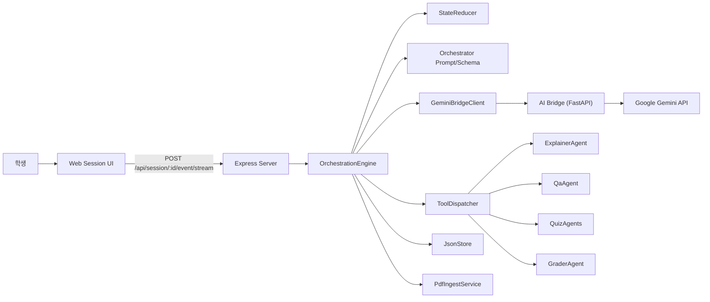

# MergeEduAgent LLM 멀티 에이전트 아키텍처

- 문서 버전: `v2.1`
- 최종 점검일: `2026-04-13`
- 상태: `구현 반영본`
- 범위: `LLM planner`, `통합 학습자 메모리`, `개인화 설명/시험`, `스트리밍`, `fallback`

## 1. 목표와 현재 상태

현재 구조의 핵심은 세션 오케스트레이션의 주 경로를
`규칙 기반 분기기`에서 `LLM planner`로 옮기고,
실행 자체는 여전히 제한된 tool call로만 수행하는 것이다.

현재 구현이 실제로 달성한 목표는 다음과 같다.

- 설명 시작/보류를 plan JSON으로 결정
- 자유 질문을 QA tool로 라우팅
- 퀴즈 생성과 채점을 tool call로 결정
- 복습/재시험 루프를 이벤트 기반으로 연결
- 학생 개인화 메모리를 `memoryWrite`로 갱신
- thought는 스트리밍하고 실행물은 schema-validated JSON으로 제한

동시에 현재 구현은 완전한 무조건 LLM 모드가 아니라,
다음 fallback도 함께 유지한다.

- `SAVE_AND_EXIT`
- `geminiFile` 부재
- 브리지/모델 실패
- 테스트/복구용 deterministic plan

## 2. 시스템 컨텍스트

## 3. 핵심 설계 요약

### 3.1 Primary Planner: LLM 오케스트레이터

현재 세션 메인 경로는 `OrchestrationEngine.planWithLlm(...)`이다.

실행 흐름:

1. `Orchestrator.buildPrompt(...)`
2. `Orchestrator.getResponseJsonSchema()`
3. `GeminiBridgeClient.orchestrateSessionStream(...)`
4. `parseOrchestratorPlan(...)`
5. `ToolDispatcher.dispatch(...)`

LLM은 “어떤 tool을 어떤 순서로 호출할지”만 결정하고,
실행은 여전히 서버가 담당한다.

### 3.2 Fallback Planner

아래 상황에서는 `Orchestrator.fallback(...)`을 사용한다.

- `SAVE_AND_EXIT` 이벤트
- 강의 PDF에 `geminiFile`이 없는 경우
- LLM 호출 실패
- structured JSON plan 정리가 실패한 경우

즉, 현재 구조는 `LLM planner 우선 + deterministic fallback 유지` 구조다.

### 3.3 통합 학습자 메모리

세션의 `integratedMemory`는 아래 필드를 가진다.

- `summaryMarkdown`
- `strengths`
- `weaknesses`
- `misconceptions`
- `explanationPreferences`
- `preferredQuizTypes`
- `targetDifficulty`
- `nextCoachingGoals`
- `lastUpdatedAt`

LLM은 매 턴 이 메모리를 강제 갱신하지 않는다.
오케스트레이터가 강한 근거가 있다고 판단할 때만 `memoryWrite.shouldPersist = true`를 사용한다.

### 3.4 memoryWrite 병합 방식

`applyLearnerMemoryWrite(...)`는 다음을 수행한다.

- 문자열 배열은 중복 제거 후 merge
- `preferredQuizTypes`는 최대 4개 유지
- `targetDifficulty` 갱신 가능
- `learnerLevel`, `confidence`를 함께 업데이트 가능
- 최종적으로 `learnerModel.strongConcepts`, `weakConcepts`도 재계산

즉, 메모리 갱신은 단순 설명 메모가 아니라
후속 설명/퀴즈/채점 행동을 바꾸는 학습자 상태 업데이트다.

### 3.5 개인화 전달

통합 메모리는 아래 agent 입력으로 실제 전달된다.

- `ExplainerAgent`
  - 설명 깊이와 강조 포인트 조절
- `QaAgent`
  - 답변 밀도와 예시 수준 조절
- `QuizAgents`
  - `targetDifficulty`, 약점 개념, 퀴즈 선호 반영
- `GraderAgent`
  - 피드백에서 오개념/보완 포인트 반영

### 3.6 토큰/컨텍스트 절감 전략

현재 구현은 아래 방식으로 컨텍스트를 줄인다.

- PDF는 최초 업로드 후 `geminiFile`로 재사용
- AI Bridge에서 `cached_content`를 생성할 수 있으면 재사용
- 오케스트레이터 프롬프트에는 최근 메시지/최근 퀴즈/페이지 이력/통합 메모만 압축 포함
- 긴 세션에서는 `conversationSummary`를 다시 사용
- 퀴즈 생성 컨텍스트는 우선 `buildPageHistoryDigest(...)`
- digest가 비어 있으면 `readCumulativeContext(...)`로 현재 페이지까지 누적 PDF 텍스트 사용

## 4. 런타임 처리 파이프라인

1. 클라이언트가 `SESSION_ENTERED`, `USER_MESSAGE`, `QUIZ_SUBMITTED` 같은 이벤트를 보낸다.
2. `StateReducer`가 즉시 반영 가능한 상태를 먼저 갱신한다.
3. `PdfIngestService`가 현재/이전/다음 페이지 텍스트를 읽는다.
4. `OrchestrationEngine`이 오케스트레이터 prompt와 schema를 준비한다.
5. AI Bridge가 Gemini에 스트리밍 요청을 보낸다.
6. `thought_delta`는 UI에 즉시 전달된다.
7. `answer` 채널의 최종 JSON plan은 schema로 검증된다.
8. `memoryWrite`가 있으면 세션 메모리에 병합된다.
9. `ToolDispatcher`가 tool action을 순차 실행한다.
10. 새 메시지, page state, learner model, UI patch를 만든다.
11. `SummaryService`가 `conversationSummary`를 갱신한다.
12. 새 채점 결과가 있으면 `quiz-results.json`에 추가 로그를 남긴다.
13. 세션을 저장한다.

## 5. 오케스트레이터 프롬프트 구성

현재 prompt에는 아래 정보가 들어간다.

- 이벤트 타입과 payload
- 현재 페이지 번호와 전체 페이지 수
- 현재 페이지 상태
- 핵심 페이지 추정 결과
- 최근 점수 통계
- 권장 퀴즈 유형
- 권장 설명 깊이
- 현재 페이지 텍스트
- 이전/다음 페이지 텍스트
- 통합 학습자 메모리 digest
- `conversationSummary`
- 최근 메시지 digest
- 최근 퀴즈 digest
- 페이지 이력 digest
- tool catalog와 example JSON
- `memoryWrite` 작성 규칙

핵심 제약은 아래와 같다.

- answer 채널은 JSON 외 텍스트 금지
- action 수는 최대 4개
- 설명/질문/시험/복습/이동은 모두 tool call로 표현
- 메모리는 필요할 때만 갱신

## 6. Tool 호출 매핑

| JSON `tool` | 의미 | 실제 실행 위치 |
|---|---|---|
| `APPEND_ORCHESTRATOR_MESSAGE` | 단순 안내 | ToolDispatcher |
| `APPEND_SYSTEM_MESSAGE` | 시스템 안내 | ToolDispatcher |
| `PROMPT_BINARY_DECISION` | 예/아니오 위젯 | ToolDispatcher |
| `OPEN_QUIZ_TYPE_PICKER` | 퀴즈 유형 선택 위젯 | ToolDispatcher |
| `SET_CURRENT_PAGE` | 페이지 직접 이동 | ToolDispatcher |
| `EXPLAIN_PAGE` | 설명 생성 | ExplainerAgent |
| `ANSWER_QUESTION` | 질문응답 | QaAgent |
| `GENERATE_QUIZ_MCQ` | 객관식 퀴즈 | QuizAgents |
| `GENERATE_QUIZ_OX` | OX 퀴즈 | QuizAgents |
| `GENERATE_QUIZ_SHORT` | 단답형 퀴즈 | QuizAgents |
| `GENERATE_QUIZ_ESSAY` | 서술형 퀴즈 | QuizAgents |
| `AUTO_GRADE_MCQ_OX` | MCQ/OX 자동 채점 | ToolDispatcher 내부 |
| `GRADE_SHORT_OR_ESSAY` | SHORT/ESSAY 채점 | GraderAgent |
| `WRITE_FEEDBACK_ENTRY` | 내부 진행 메모 | ToolDispatcher 내부 |

## 7. 사고 스트리밍과 구조화 응답

세션 오케스트레이션에서 스트리밍은 두 층으로 나뉜다.

### 7.1 오케스트레이터 스트림

- 브리지 내부 이벤트: `thought_delta`, `answer_delta`, `done`, `error`
- 서버 외부 이벤트: `orchestrator_thought_delta`, `final`, `error`

현재 서버는 오케스트레이터의 `thought`만 UI에 즉시 보여주고,
`answer`는 내부에서 JSON으로 정리한 뒤 실행한다.

### 7.2 하위 agent 스트림

`ExplainerAgent`, `QaAgent`, `QuizAgents`, `GraderAgent`도
각자 `thought`와 `answer`를 스트리밍할 수 있다.

서버는 이를 `agent_delta`로 노출하고,
최종 결과의 `thoughtSummary`는 메시지의 `thoughtSummaryMarkdown`에 저장한다.

## 8. 주요 유스케이스

### 8.1 세션 진입 후 설명 시작

1. 사용자가 세션에 들어오면 `SESSION_ENTERED`
2. 오케스트레이터가 `START_EXPLANATION_DECISION` 위젯을 선택
3. 사용자가 수락하면 `EXPLAIN_PAGE`
4. 필요 시 퀴즈 진행 여부까지 후속 plan으로 연결

### 8.2 강의 중 자유 질문

1. 사용자가 일반 질문을 입력
2. `StateReducer`가 user message를 먼저 append
3. 오케스트레이터가 `ANSWER_QUESTION`을 선택
4. QA agent가 페이지 문맥 + learner memory를 반영해 답변
5. 필요 시 다음 페이지 여부를 다시 묻는다

### 8.3 오케스트레이터가 자율적으로 퀴즈 시점 결정

현재 오케스트레이터는 아래 신호를 함께 본다.

- 현재 페이지 중요도
- 최근 점수 흐름
- 현재 페이지의 기존 퀴즈 시도 횟수
- `targetDifficulty`
- 약점/오개념 메모

이 결과에 따라 다음 중 하나를 고른다.

- `PROMPT_BINARY_DECISION(QUIZ_DECISION)`
- `OPEN_QUIZ_TYPE_PICKER`
- 직접 `GENERATE_QUIZ_*`
- 퀴즈 생략 후 다음 페이지 여부 질문

### 8.4 퀴즈 실패 후 복습/재시험 루프

현재 구현에서 이 루프는 두 단계로 나뉜다.

1. 채점 직후:
   - `ToolDispatcher`가 점수 기준 미달을 직접 감지
   - 즉시 `REVIEW_DECISION` 위젯 메시지를 append
2. 사용자가 복습 수락:
   - 다음 이벤트에서 오케스트레이터가 `EXPLAIN_PAGE(detailLevel=DETAILED)`와 `RETEST_DECISION`을 계획

즉, “낮은 점수 감지”는 dispatcher가 하고,
“복습 이후 다음 루프 설계”는 오케스트레이터가 담당한다.

### 8.5 페이지 이동

페이지 이동은 하나의 경로만 있는 것이 아니다.

- 사용자가 PDF 뷰어에서 직접 넘기는 `PAGE_CHANGED`
- `USER_MESSAGE` 안의 next/prev 명령
- 오케스트레이터의 `SET_CURRENT_PAGE`

특히 `SET_CURRENT_PAGE`는 재설명이나 이전 페이지 회귀 같은
오케스트레이터 주도 이동에 사용된다.

## 9. 실패와 복구

현재 구조의 주요 fallback은 다음과 같다.

- plan JSON을 못 받으면 deterministic fallback plan
- `geminiFile`이 없으면 AI tool 대신 SYSTEM 메시지
- tool 하나가 실패해도 전체 요청은 계속 진행
- 마지막 페이지 초과 이동은 안내 메시지로 막음
- 과거 세션에 `integratedMemory`가 없으면 로드시 초기 메모리로 보정

## 10. 구현 파일 맵

- 오케스트레이터 프롬프트/툴 카탈로그: `apps/server/src/services/agents/Orchestrator.ts`
- 런타임 엔진: `apps/server/src/services/engine/OrchestrationEngine.ts`
- 툴 실행기: `apps/server/src/services/engine/ToolDispatcher.ts`
- 통합 메모리: `apps/server/src/services/engine/LearnerMemoryService.ts`
- 브리지 클라이언트: `apps/server/src/services/llm/GeminiBridgeClient.ts`
- Gemini 브리지: `apps/ai-bridge/main.py`
- 세션 라우트: `apps/server/src/routes/session.ts`

## 11. Google Gemini 기능 사용 요약

현재 구현에서 실제로 쓰는 Gemini 측 핵심 기능은 다음과 같다.

- `thinking_config.include_thoughts = true`
- `response_mime_type = "application/json"`
- `response_json_schema = <orchestrator plan schema>`
- `cached_content = <uploaded PDF cache>`

오케스트레이션 경로를 한 줄로 요약하면:

`생각은 스트리밍`, `실행물은 JSON schema 강제`, `PDF는 캐시 재사용`

## 12. 결론

현재 MergeEduAgent의 LLM 멀티 에이전트 구조는
오케스트레이터를 단순 분기기가 아니라
`학생 상태와 페이지 문맥을 보고 설명/질문/시험/복습을 고르는 planner`
로 승격시킨 구조다.

다만 실행은 여전히 아래 장치로 제한한다.

- schema-validated JSON plan
- 제한된 tool catalog
- dispatcher 중심 실행
- deterministic fallback

즉, 현재 구조의 본질은
`자율적 계획 수립은 LLM에 맡기고, 실행 안전성은 서버가 강하게 통제한다`
로 정리할 수 있다.
