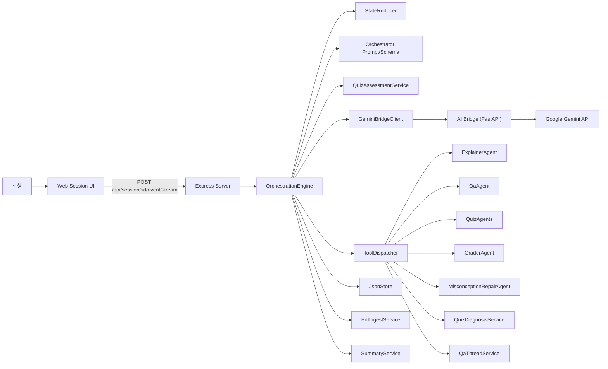

# MergeEduAgent LLM 멀티 에이전트 아키텍처

- 문서 버전: `v2.4`
- 최종 점검일: `2026-04-25`
- 상태: `구현 반영본`
- 범위: `LLM planner`, `pedagogyPolicy`, `진단/교정`, `assessment handoff`, `통합 학습자 메모리`, `스트리밍`, `fallback`

## 1. 목표와 현재 상태

현재 구조의 핵심은 세션 오케스트레이션의 주 경로를
`규칙 기반 분기기`에서 `LLM planner`로 옮기되,
실행 자체는 여전히 제한된 tool call과 verifier로 강하게 통제하는 것이다.

현재 구현이 실제로 달성한 목표는 다음과 같다.

- 설명 시작/보류를 plan JSON으로 결정
- 자유 질문을 QA tool로 라우팅하고, 같은 페이지 follow-up은 QA thread로 이어감
- `pedagogyPolicy`를 먼저 정하고 verifier 제약 안에서만 tool call을 실행
- 퀴즈 생성과 채점을 tool call로 결정
- 저득점 구간을 `QuizDiagnosisService -> activeIntervention -> REPAIR_MISCONCEPTION` 루프로 연결
- 학생 개인화 메모리를 `memoryWrite`로 갱신
- 퀴즈 채점 결과를 `quizAssessments`에 저장하고 다음 턴 `assessmentDigest`로 handoff
- thought는 스트리밍하고 실행물은 schema-validated JSON으로 제한
- pending assessment가 없는 MCQ/OX 제출은 LLM planner와 PDF page context를 생략하는 deterministic fast path로 처리

동시에 현재 구현은 완전한 무조건 LLM 모드가 아니라,
다음 fallback도 함께 유지한다.

- `SAVE_AND_EXIT`
- pending assessment가 없는 MCQ/OX 제출 fast path
- `geminiFile` 부재
- 브리지/모델 실패
- structured JSON plan 파싱 실패
- 테스트/복구용 deterministic plan

## 2. 시스템 컨텍스트

## 3. 핵심 설계 요약

### 3.1 Primary Planner: LLM 오케스트레이터

현재 세션의 일반 메인 경로는 `OrchestrationEngine.planWithLlm(...)`이다.
단, pending assessment가 없는 MCQ/OX 제출은 `Orchestrator.fallback(...)` 기반 fast path로 바로 `AUTO_GRADE_MCQ_OX`를 실행한다.

실행 흐름:

1. `Orchestrator.buildPrompt(...)`
2. `Orchestrator.getResponseJsonSchema()`
3. `GeminiBridgeClient.orchestrateSessionStream(...)`
4. `parseOrchestratorPlan(...)`
5. `normalizePlan(...)`
6. `ToolDispatcher.dispatch(...)`

LLM은 “어떤 tool을 어떤 순서로 호출할지”만 결정하고,
실행은 여전히 서버가 담당한다.

### 3.2 Pedagogy Policy + Verifier

현재 구조는 단순 tool selection이 아니라,
각 턴에 먼저 교수 목적을 고르는 구조다.

- `pedagogyPolicy.mode`
  - `EXPLAIN_FIRST`, `DIAGNOSE`, `MISCONCEPTION_REPAIR`, `MINIMAL_HINT`, `CHECK_READINESS`, `HOLD_BACK`, `SRL_REFLECTION`, `ADVANCE`
- `allowDirectAnswer`
- `hintDepth`
- `interventionBudget`

`Orchestrator`가 이 정책을 plan에 넣고,
`ToolDispatcher.verifyAndPatchPlan(...)`이 다시 아래를 강제한다.

- 정책과 action 충돌 시 trim 또는 patch
- repair action 자동 주입
- hint-only turn 보정
- `interventionBudget` 및 hard cap 적용

즉, 현재 구조는 `LLM planner 우선 + policy verifier 유지` 구조다.

### 3.3 Active Intervention: 진단/교정 루프

저득점 퀴즈는 단순 `복습할까요?`에서 끝나지 않는다.

현재 구현은 아래 흐름을 쓴다.

1. grading 완료
2. `QuizDiagnosisService`가 focus concepts와 diagnostic prompt 생성
3. `SessionState.activeIntervention` 저장
4. 학생의 다음 `USER_MESSAGE`를 진단 답변으로 우선 해석
5. `REPAIR_MISCONCEPTION`
6. `MisconceptionRepairAgent`가 맞춤 교정 설명 생성
7. `RETEST_DECISION`으로 짧은 재확인 연결

### 3.4 통합 학습자 메모리

세션의 `integratedMemory`는 아래 필드를 가진다.

- `summaryMarkdown`
- `strengths`
- `weaknesses`
- `misconceptions`
- `explanationPreferences`
- `preferredQuizTypes`
- `targetDifficulty`
- `nextCoachingGoals`
- `lastUpdatedAt`

LLM은 매 턴 이 메모리를 강제 갱신하지 않는다.
오케스트레이터가 강한 근거가 있다고 판단할 때만 `memoryWrite.shouldPersist = true`를 사용한다.

### 3.5 Assessment Artifact + Next-turn Handoff

Ver4부터 채점 결과는 점수만 남기지 않는다.

현재 구조는 아래를 추가로 수행한다.

- grading 직후 `QuizAssessmentService.buildQuizAssessment(...)`
- `SessionState.quizAssessments[]`에 `PENDING` 상태로 저장
- 다음 턴 `preparePendingAssessmentHandoff(...)`
- `assessmentDigest`를 오케스트레이터 prompt에 주입
- turn 저장 직전 `markAssessmentsConsumed(...)`

assessment는 같은 턴에 곧바로 memory에 쓰지 않는다.
즉, `assessment = 다음 턴 personalization 후보를 위한 세션 artifact`다.

### 3.6 QA Thread Memory

현재 QA는 세션 전체 대화를 모두 끌고 가지 않는다.

- 같은 페이지의 질문응답만 `qaThread.turns`에 최대 6개 유지
- follow-up 질문이면 `threadMode = FOLLOW_UP`
- 새 독립 질문이면 `threadMode = START_NEW`
- 오케스트레이터 prompt와 QaAgent 입력 모두 `qaThreadDigest`를 사용

즉, QA는 `세션 전체 대화`가 아니라 `현재 페이지 follow-up 문맥`만 이어간다.

### 3.7 토큰/컨텍스트 절감 전략

현재 구현은 아래 방식으로 컨텍스트를 줄인다.

- PDF는 최초 업로드 후 `geminiFile`로 재사용
- AI Bridge에서 `cached_content`를 생성할 수 있으면 재사용
- 오케스트레이터 프롬프트에는 최근 메시지/최근 퀴즈/페이지 이력/통합 메모/QA thread/assessment만 압축 포함
- 긴 세션에서는 `conversationSummary`를 다시 사용
- 퀴즈 생성 컨텍스트는 우선 `buildPageHistoryDigest(...)`
- digest가 비어 있으면 `readCumulativeContext(...)`로 현재 페이지까지 누적 PDF 텍스트 사용
- `readCumulativeContext(...)`는 char budget 도달 시 page 순회를 조기 중단한다.

## 4. 런타임 처리 파이프라인

1. 클라이언트가 `SESSION_ENTERED`, `USER_MESSAGE`, `QUIZ_SUBMITTED` 같은 이벤트를 보낸다.
2. `OrchestrationEngine`이 같은 session id 기준 lock 안에서 이벤트 처리를 시작한다.
3. `StateReducer`가 즉시 반영 가능한 상태를 먼저 갱신한다.
4. `SAVE_AND_EXIT`가 아니면 `QuizAssessmentService`가 pending assessment를 골라 다음 턴용 handoff digest를 만든다.
5. pending assessment가 없는 MCQ/OX 제출이면 PDF context와 LLM planner를 건너뛰고 fallback plan으로 바로 채점한다.
6. 일반 경로에서는 `PdfIngestService`가 현재/이전/다음 페이지 텍스트를 읽는다.
7. `OrchestrationEngine`이 오케스트레이터 prompt와 schema를 준비한다.
8. AI Bridge가 Gemini에 스트리밍 요청을 보낸다.
9. `thought_delta`는 UI에 즉시 전달된다.
10. `answer` 채널의 최종 JSON plan은 schema로 검증된다.
11. `normalizePlan(...)`이 빠진 `pedagogyPolicy`를 보정한다.
12. `memoryWrite`가 있으면 세션 메모리에 병합된다.
13. `ToolDispatcher`가 verifier를 거쳐 tool action을 순차 실행한다.
14. grading 직후 `QuizAssessmentRecord`가 세션에 저장된다.
15. 저득점이면 `activeIntervention`이 열리고 이후 repair turn으로 이어진다.
16. 새 메시지, page state, learner model, UI patch를 만든다.
17. `SummaryService`가 `conversationSummary`를 갱신한다.
18. 이번 턴에 prompt로 넘긴 assessment는 `CONSUMED` 처리한다.
19. 새 채점 결과가 있으면 `quiz-results.json`에 추가 로그를 남긴다.
20. 세션을 저장한다.

세션 stream 요청이 중간에 닫히면 Express route의 `AbortController`가 abort되고,
signal은 orchestrator stream과 하위 agent stream fetch까지 전달된다.
abort 후에는 stale final 저장과 `final/error` emit을 하지 않는다.

## 5. 오케스트레이터 프롬프트 구성

현재 prompt에는 아래 정보가 들어간다.

- 이벤트 타입과 payload
- 현재 페이지 번호와 전체 페이지 수
- 현재 페이지 상태
- 핵심 페이지 추정 결과
- 최근 점수 통계
- 권장 퀴즈 유형
- 권장 설명 깊이
- 현재 페이지 텍스트
- 이전/다음 페이지 텍스트
- 통합 학습자 메모리 digest
- `conversationSummary`
- 최근 메시지 digest
- 최근 퀴즈 digest
- 페이지 이력 digest
- 현재 QA 후속 질문 문맥(`qaThreadDigest`)
- 현재 오답 교정 개입 상태(`activeInterventionDigest`)
- 최근 pending assessment handoff(`assessmentDigest`)
- tool catalog와 example JSON
- `memoryWrite` 작성 규칙
- `pedagogyPolicy` 결정 규칙과 hard constraints

핵심 제약은 아래와 같다.

- answer 채널은 JSON 외 텍스트 금지
- LLM prompt는 action 수 4개 이하를 요구한다
- dispatcher verifier의 최종 hard cap은 8개다
- `pedagogyPolicy`를 먼저 정하고 tool을 고른다
- 설명/질문/시험/복습/이동은 모두 tool call로 표현
- assessment digest는 관찰 메모이지 행동 지시가 아니다
- 메모리는 필요할 때만 갱신
- 단일 assessment 하나만으로 `learnerLevel`과 `confidence`를 바꾸지 않는다

## 6. Tool 호출 매핑

| JSON `tool` | 의미 | 실제 실행 위치 |
|---|---|---|
| `APPEND_ORCHESTRATOR_MESSAGE` | 단순 안내 | ToolDispatcher |
| `APPEND_SYSTEM_MESSAGE` | 시스템 안내 | ToolDispatcher |
| `PROMPT_BINARY_DECISION` | 예/아니오 위젯 | ToolDispatcher |
| `OPEN_QUIZ_TYPE_PICKER` | 퀴즈 유형 선택 위젯 | ToolDispatcher |
| `SET_CURRENT_PAGE` | 페이지 직접 이동 | ToolDispatcher |
| `EXPLAIN_PAGE` | 설명 생성 | ExplainerAgent |
| `ANSWER_QUESTION` | 질문응답 | QaAgent |
| `GENERATE_QUIZ_MCQ` | 객관식 퀴즈 | QuizAgents |
| `GENERATE_QUIZ_OX` | OX 퀴즈 | QuizAgents |
| `GENERATE_QUIZ_SHORT` | 단답형 퀴즈 | QuizAgents |
| `GENERATE_QUIZ_ESSAY` | 서술형 퀴즈 | QuizAgents |
| `AUTO_GRADE_MCQ_OX` | MCQ/OX 자동 채점 | ToolDispatcher 내부, PDF/Gemini guard 이전 |
| `GRADE_SHORT_OR_ESSAY` | SHORT/ESSAY 채점 | GraderAgent |
| `REPAIR_MISCONCEPTION` | 오개념 교정 설명 | MisconceptionRepairAgent |
| `WRITE_FEEDBACK_ENTRY` | 내부 진행 메모 | ToolDispatcher 내부 |

## 7. 사고 스트리밍과 구조화 응답

세션 오케스트레이션에서 스트리밍은 두 층으로 나뉜다.

### 7.1 오케스트레이터 스트림

- 브리지 내부 이벤트: `thought_delta`, `answer_delta`, `done`, `error`
- 서버 외부 이벤트: `orchestrator_thought_delta`, `final`, `error`

현재 서버는 오케스트레이터의 `thought`만 UI에 즉시 보여주고,
`answer`는 내부에서 JSON으로 정리한 뒤 실행한다.

### 7.2 하위 agent 스트림

`ExplainerAgent`, `QaAgent`, `QuizAgents`, `GraderAgent`, `MisconceptionRepairAgent`도
각자 `thought`와 `answer`를 스트리밍할 수 있다.

서버는 이를 `agent_delta`로 노출하고,
최종 결과의 `thoughtSummary`는 메시지의 `thoughtSummaryMarkdown`에 저장한다.

현재 stream 메서드 계약은 대체로 `(input, onDelta?, signal?)` 형태다.
이름은 `ExplainerAgent.runStream`, `QaAgent.runStream`, `QuizAgents.runStream`,
`GraderAgent.gradeStream`, `MisconceptionRepairAgent.runStream`이다.
`MisconceptionRepairAgent`는 전용 bridge endpoint가 아니라 `answerQuestionStream`을 교정 prompt로 재사용한다.
교정 결과의 stream/message label은 별도 `REPAIR`가 아니라 현재 `EXPLAINER`로 기록된다.

### 7.3 Abort signal

세션 이벤트 stream에 한해 클라이언트 연결 종료가 서버 fetch abort로 전파된다.
`/session/:sessionId/event/stream -> OrchestrationEngine -> GeminiBridgeClient.streamBridge(...) -> 하위 agent stream`
순서로 signal이 전달된다.
단, signal은 서버 fetch 제어용이며 AI bridge JSON payload에는 포함하지 않는다.

## 8. 상태 레이어와 영속화

현재 `SessionState`는 단순 대화 기록만 들고 있지 않다.

- `integratedMemory`
  - 개인화 설명/퀴즈 정책을 바꾸는 누적 메모
- `qaThread`
  - 현재 페이지 follow-up 질문응답
- `activeIntervention`
  - 진단 질문 대기 / 교정 완료 상태
- `quizAssessments`
  - 다음 턴 handoff용 assessment artifact
- `conversationSummary`
  - 긴 세션 컨텍스트 압축

`JsonStore`는 세션 로드시 구버전 JSON을 안전하게 backfill 한다.

- `integratedMemory`
- `qaThread`
- `activeIntervention`
- `quizAssessments`

또한 `/session/:sessionId/save`는 client state merge를 막고
서버 상태만 다시 저장해 영속화 경계를 보호한다.
이 save route와 세션 이벤트 처리 전체는 같은 session id 기준 process-local lock 안에서 실행된다.

## 9. 주요 유스케이스

### 9.1 세션 진입 후 설명 시작

1. 사용자가 세션에 들어오면 `SESSION_ENTERED`
2. 오케스트레이터가 `START_EXPLANATION_DECISION` 위젯을 선택
3. 사용자가 수락하면 `EXPLAIN_PAGE`
4. 필요 시 퀴즈 진행 여부까지 후속 plan으로 연결

### 9.2 강의 중 자유 질문과 follow-up

1. 사용자가 일반 질문을 입력
2. `StateReducer`가 user message를 먼저 append
3. 오케스트레이터가 `ANSWER_QUESTION`을 선택
4. 같은 페이지 follow-up이면 `threadMode = FOLLOW_UP`
5. QA agent가 페이지 문맥 + learner memory + qa thread를 반영해 답변

### 9.3 저득점 후 진단/교정 루프

1. 사용자가 퀴즈를 제출
2. grading tool이 채점 수행
3. `QuizDiagnosisService`가 진단 질문 생성
4. `activeIntervention` 저장
5. 학생이 다음 턴에 답변
6. 오케스트레이터가 `REPAIR_MISCONCEPTION`을 계획
7. `MisconceptionRepairAgent`가 짧은 맞춤 교정 설명 제공

### 9.4 채점 결과의 다음 턴 handoff

1. grading 직후 `QuizAssessmentRecord` 저장
2. 다음 orchestration turn에서 `assessmentDigest`를 prompt에 주입
3. 오케스트레이터가 필요할 때만 `memoryWrite`에 반영
4. handoff가 끝난 assessment는 `CONSUMED` 처리

### 9.5 페이지 이동

페이지 이동은 하나의 경로만 있는 것이 아니다.

- 사용자가 PDF 뷰어에서 직접 넘기는 `PAGE_CHANGED`
- `USER_MESSAGE` 안의 next/prev 명령
- 오케스트레이터의 `SET_CURRENT_PAGE`

특히 `SET_CURRENT_PAGE`는 재설명이나 이전 페이지 회귀 같은
오케스트레이터 주도 이동에 사용된다.

## 10. 실패와 복구

현재 구조의 주요 fallback은 다음과 같다.

- plan JSON을 못 받으면 deterministic fallback plan
- pending assessment가 없는 MCQ/OX 제출은 deterministic fast path
- `geminiFile`이 없으면 AI tool 대신 SYSTEM 메시지
- tool 하나가 실패해도 전체 요청은 계속 진행
- assessment 생성이 실패해도 grading/repair는 계속 진행
- 세션 stream abort 후에는 stale final 저장과 추가 stream emit을 하지 않음
- 마지막 페이지 초과 이동은 안내 메시지로 막음
- 과거 세션에 `integratedMemory`, `qaThread`, `activeIntervention`, `quizAssessments`가 없으면 로드시 보정
- save route는 클라이언트가 server-owned state를 덮어쓰지 못하게 보호
- JsonStore는 process-local file/session lock과 unique temp atomic write를 사용함

## 11. 구현 파일 맵

- 오케스트레이터 프롬프트/툴 카탈로그: `apps/server/src/services/agents/Orchestrator.ts`
- 런타임 엔진: `apps/server/src/services/engine/OrchestrationEngine.ts`
- 툴 실행기 + verifier: `apps/server/src/services/engine/ToolDispatcher.ts`
- 통합 메모리: `apps/server/src/services/engine/LearnerMemoryService.ts`
- QA thread: `apps/server/src/services/engine/QaThreadService.ts`
- 진단/교정: `apps/server/src/services/engine/QuizDiagnosisService.ts`
- assessment handoff: `apps/server/src/services/engine/QuizAssessmentService.ts`
- 브리지 클라이언트: `apps/server/src/services/llm/GeminiBridgeClient.ts`
- Gemini 브리지: `apps/ai-bridge/main.py`
- 세션 라우트: `apps/server/src/routes/session.ts`

## 12. Google Gemini 기능 사용 요약

현재 구현에서 실제로 쓰는 Gemini 측 핵심 기능은 다음과 같으며, 적용 범위가 나뉜다.

- `thinking_config.include_thoughts = true`
- `response_mime_type = "application/json"`: JSON 응답이 필요한 경로
- `response_json_schema`: 오케스트레이터 plan stream과 학생 리포트 분석 경로
- prompt JSON + 서버 파싱: 하위 quiz/grade stream 경로
- `cached_content`: PDF 기반 streaming 경로에서 생성 가능할 때 사용

오케스트레이션 경로를 한 줄로 요약하면:

`생각은 스트리밍`, `실행물은 JSON schema 강제`, `행동은 policy/verifier로 제한`, `PDF는 캐시 재사용`

## 13. 결론

현재 MergeEduAgent의 LLM 멀티 에이전트 구조는
오케스트레이터를 단순 분기기가 아니라
`학생 상태, QA 문맥, 오답 개입 상태, assessment handoff를 함께 보고 다음 행동을 고르는 planner`
로 승격시킨 구조다.

다만 실행은 여전히 아래 장치로 제한한다.

- schema-validated JSON plan
- `pedagogyPolicy`
- dispatcher 중심 실행
- verifier
- deterministic fallback

즉, 현재 구조의 본질은
`자율적 계획 수립은 LLM에 맡기고, 실행 안전성과 상태 일관성은 서버가 강하게 통제한다`
로 정리할 수 있다.
