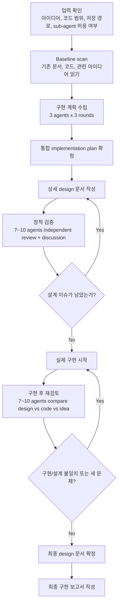
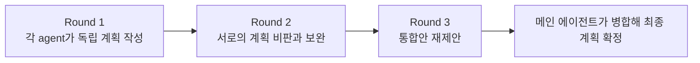
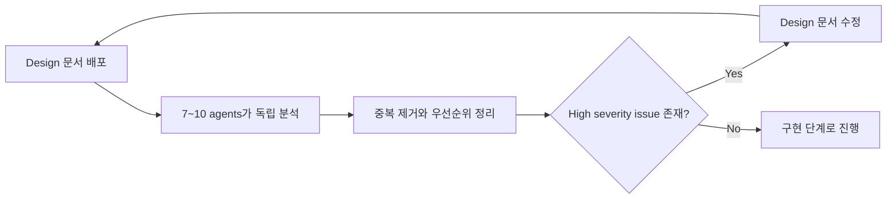
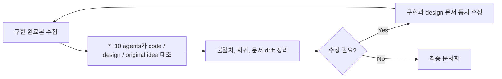

# Idea To Implementation Skill Flow

이 문서는 `idea-to-implementation` 스킬이 실제로 어떤 순서와 루프로 동작하는지 빠르게 파악하기 위한 가이드다.
핵심은 "아이디어 -> 설계 -> 정적 검증 -> 구현 -> 구현 후 검토 -> 최종 문서화"가 한 번에 직선으로 끝나지 않고, 중간 검증 결과에 따라 되돌아가는 루프를 가진다는 점이다.

## 한눈에 보기

- 계획 단계는 `3 agents x 3 rounds` 권장
- design 정적 검증은 `7~10 agents`, 가능하면 `10 agents`
- 구현 후 검토도 `7~10 agents`, 가능하면 `10 agents`
- 최종적으로 남겨야 하는 영구 산출물은 `design md`와 `최종 보고 md`

## 전체 흐름 다이어그램



## Planning 단계 내부 구조



## 정적 검증 단계 내부 구조



## 구현 후 재검토 단계 내부 구조



## 단계별 역할 요약

| 단계 | 주 담당 | 산출물 | 되돌아가는 조건 |
| --- | --- | --- | --- |
| Baseline scan | 메인 에이전트 | 범위 이해, 핵심 병목 정리 | 관련 코드/문서 이해가 부족함 |
| 구현 계획 수립 | planning agents + 메인 에이전트 | implementation plan | 구현 순서나 범위가 불명확함 |
| 상세 design 작성 | 메인 에이전트 | design 문서 초안 | 아직 작성 단계 |
| 정적 검증 | 7~10 review agents | 설계 결함 목록 | high severity 설계 이슈 발견 |
| 실제 구현 | 메인 에이전트 | 코드 변경, 테스트 갱신 | 설계와 코드가 어긋남 |
| 구현 후 검토 | 7~10 review agents | 구현 결함 / drift 목록 | 요구사항 누락, 회귀, 문서 drift |
| 최종 문서화 | 메인 에이전트 | 최종 design md, 최종 report md | 남은 이슈가 수용 불가 |

## 최종 문서가 설명해야 하는 것

최종 design 문서에는 아래가 분명해야 한다.

- 왜 이 구조를 택했는가
- 어떤 모듈 책임이 바뀌었는가
- 데이터 또는 제어 흐름이 어떻게 달라졌는가
- 실패 시나리오와 테스트 전략은 무엇인가

최종 보고서에는 아래가 분명해야 한다.

- 어떤 코드가 바뀌었는가
- 아이디어가 어느 코드에 반영되었는가
- 적용 전과 후 시스템 시나리오가 어떻게 달라졌는가
- 개발자가 어디부터 읽으면 전체 구조를 이해할 수 있는가

## 사용 예시 문장

```text
이 아이디어를 idea-to-implementation 스킬로 진행해줘.
계획은 3 agents x 3 rounds로 하고,
design 정적 검증과 구현 후 검토는 각각 10 agents로 해줘.
최종 design 문서는 <path>에,
최종 보고서는 <path>에 저장해줘.
```
