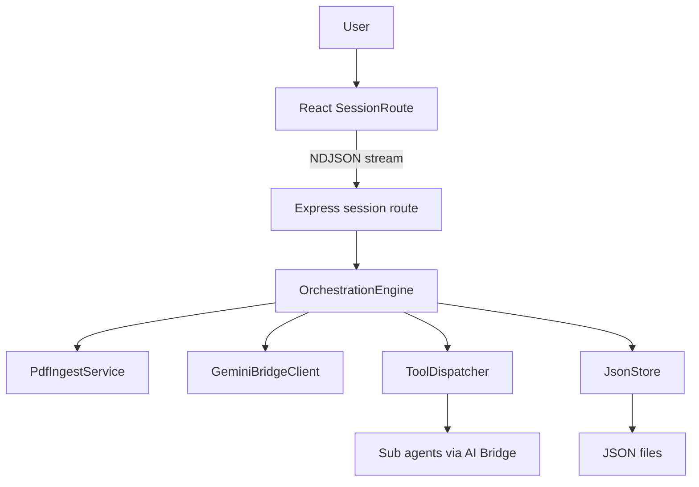
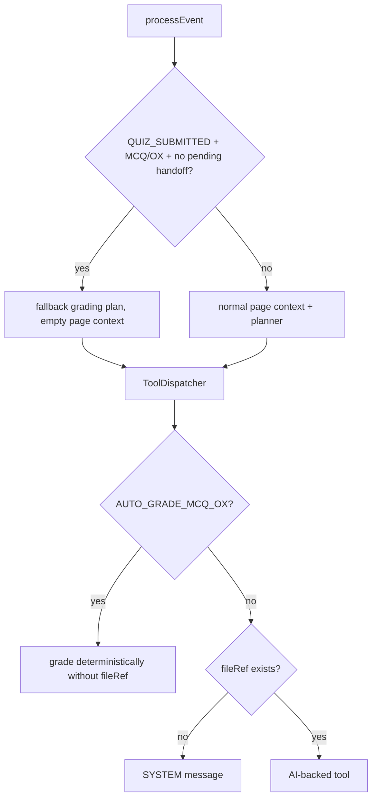
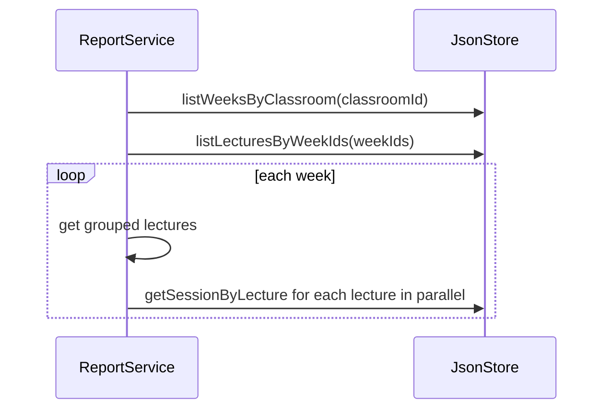
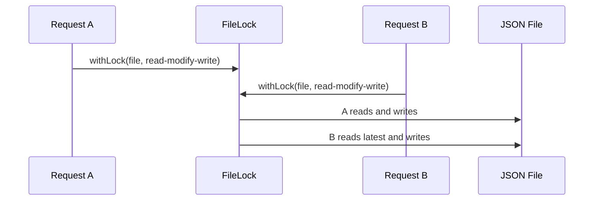
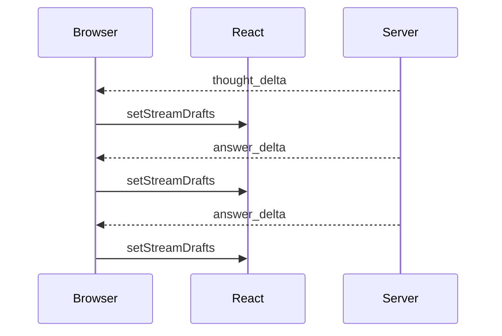
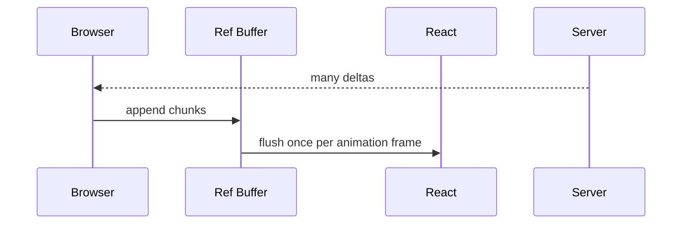
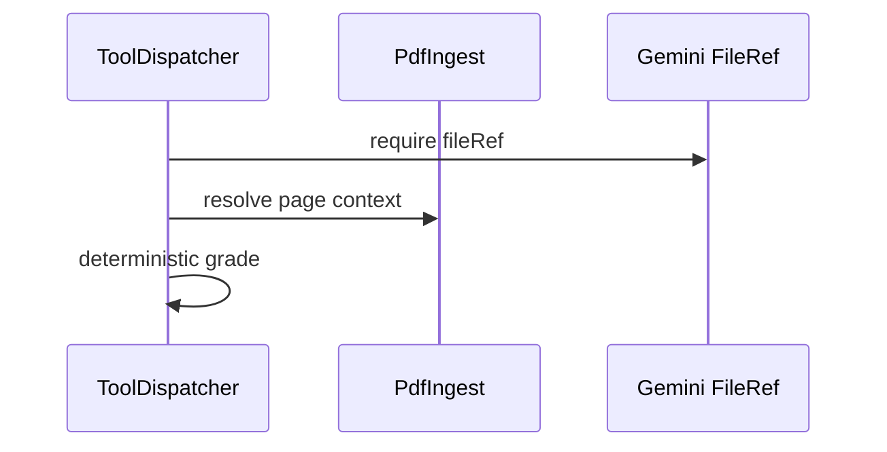
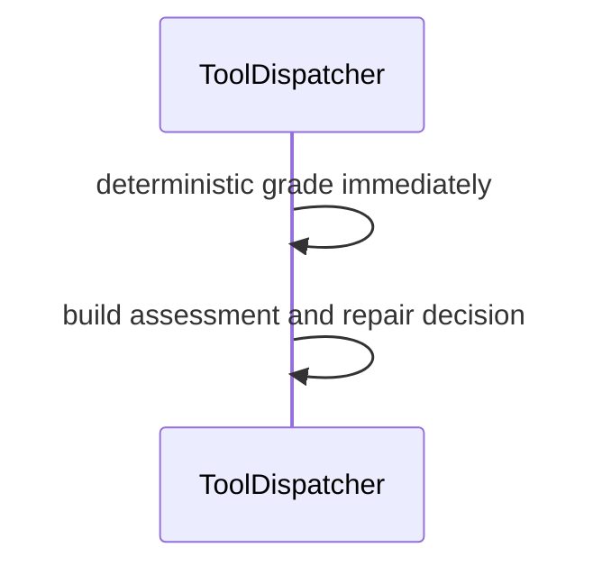
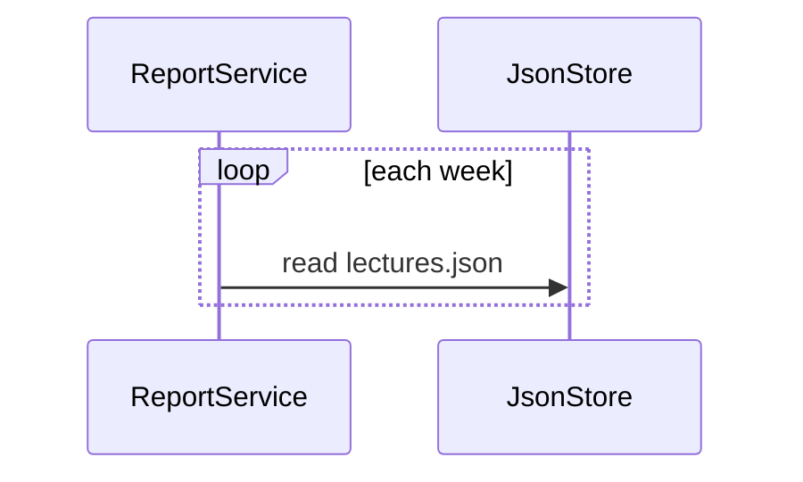
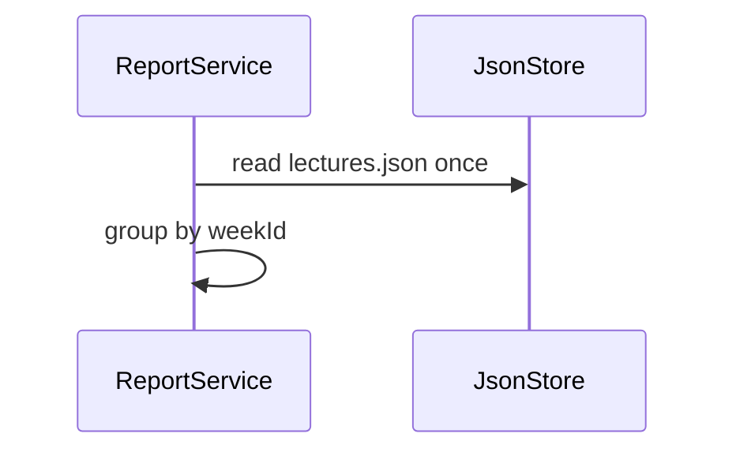

# Implementation Design

## Summary

이번 최적화는 MergeEduAgent의 기능을 늘리지 않고 기존 동작을 더 빠르고 안정적으로 만드는 변경이다.

적용 범위는 다음 7개다.

1. 세션 스트리밍 delta를 React render frame 단위로 배칭한다.
2. MCQ/OX 자동 채점은 PDF/Gemini 의존 없이 deterministic 경로로 즉시 실행한다.
3. PDF 누적 문맥 생성은 char budget 도달 시 조기 중단한다.
4. 강의실 리포트 집계는 lectures JSON을 주차별로 반복 읽지 않는다.
5. 세션 이벤트 read-modify-write와 JsonStore 파일 쓰기는 lock과 유니크 temp 파일을 사용한다.
6. 업로드 PDF 정적 응답에 캐시 헤더를 붙인다.
7. 클라이언트 stream 종료를 서버와 AI bridge까지 abort signal로 전파한다.

## Problem

현재 시스템은 학습 세션에서 LLM planner와 하위 agent 스트림을 중심으로 동작한다. LLM 자체 지연은 피하기 어렵지만, 그 주변의 불필요한 렌더링, 파일 읽기, context 조합, deterministic tool의 AI guard 통과 비용은 줄일 수 있다.

운영 측면에서는 로컬 JSON 저장소가 작은 데모에는 충분하지만, 동시 요청이 들어오면 같은 파일을 동시에 read-modify-write 할 수 있다. 특히 동일 `.tmp` 경로를 쓰는 atomic write는 충돌 가능성이 있다.

## Goals / Non-goals

## Goals

- 세션 스트리밍 중 React state update 횟수를 줄인다.
- 객관식/OX 제출은 AI bridge나 PDF fileRef 상태와 무관하게 채점한다.
- 큰 PDF에서 누적 context 생성 비용을 제한한다.
- 학생 역량 리포트 생성 시 `lectures.json` 반복 파싱을 줄인다.
- JSON 저장소의 동시 쓰기 안정성을 높인다.
- PDF 정적 파일 재방문 비용을 줄인다.

## Non-goals

- 새 학습 기능 추가
- planner 정책 변경
- LLM 호출 자체를 공격적으로 우회하는 fast path 전면 도입
- 저장소를 DB로 교체
- 백그라운드 Gemini upload 상태 머신 추가

## Current System Snapshot

병목과 리스크:

- 스트림 delta마다 `setState`가 발생한다.
- `AUTO_GRADE_MCQ_OX`도 PDF/Gemini guard 뒤에 있다.
- `readCumulativeContext()`가 전체 page text를 join한다.
- 리포트 집계가 주차 수만큼 `lectures.json`을 반복 읽는다.
- `atomicWrite()` temp path가 target별로 고정되어 있다.

## Proposed Design

### 1. Stream Delta Batching and Lifecycle

`SessionRoute`에 stream draft buffer를 둔다.

- `streamDraftBufferRef`: key별 draft 누적값
- `gradingInsightBufferRef`: 채점 thought/answer 누적값
- `streamFlushRafRef`: scheduled animation frame id
- `activeStreamAbortRef`: 현재 stream fetch 취소 controller
- `mountedRef`: unmount 이후 state update 방지
- `flushStreamBuffers()`: ref 값을 state에 반영

`handleStreamEvent()`는 delta를 받을 때 state를 바로 바꾸지 않고 ref만 갱신한 뒤 frame flush를 예약한다.

새 run이 시작되면 이전 stream은 abort하고 buffer와 pending RAF를 먼저 정리한다.
최종 응답, error, stale run, unmount 모두 같은 cleanup 함수를 통과한다.
최종 state 반영도 `runId === streamRunId.current && mountedRef.current`일 때만 수행한다.
run-scoped cleanup은 `runId === streamRunId.current`일 때만 buffer/RAF를 지운다.
예외적으로 unmount cleanup은 모든 pending 작업을 무조건 정리한다.
이렇게 해야 늦게 종료된 이전 stream이 현재 stream draft를 지우지 않는다.

세션 이벤트 스트림의 브라우저 fetch가 abort되면 route의 `AbortController`가 `OrchestrationEngine`, `ToolDispatcher`, `GeminiBridgeClient`, agent stream 메서드로 전달된다.
abort된 요청은 final state 저장을 건너뛰어 닫힌 스트림이 같은 세션 lock을 오래 점유하지 않게 한다.
강의실 리포트 분석 스트림은 아직 같은 abort 전파 계약을 갖지 않으며, 후속 최적화 후보로 둔다.

`ChatPanel`은 단순 `messages.length` 기준으로만 scroll하지 않는다.
사용자가 하단 근처에 있을 때만 pinned 상태를 유지하고, trigger는 마지막 message id와 content/thought 길이를 함께 본다.

`ChatBubble` memo는 callback stale risk 때문에 다음 조건에서만 적용한다.

- `SessionRoute`에서 quiz/binary callbacks를 `useCallback`으로 안정화한다.
- custom comparator로 callback을 무시하지 않는다.

### 2. Deterministic Grading Before AI/PDF Guard

`QUIZ_SUBMITTED + MCQ/OX + pending assessment 없음` 경로는 engine에서 좁은 deterministic fast path를 사용한다.
이때 OrchestrationEngine은 LLM planner와 `readPageContext()`를 건너뛰고 fallback plan으로 바로 `AUTO_GRADE_MCQ_OX`를 실행한다.
pending assessment가 있으면 기존처럼 planner prompt에 handoff 해야 하므로 fast path를 사용하지 않는다.

`ToolDispatcher.executeTool()`은 deterministic grading tool이 fileRef/pageContext 없이 실행될 수 있게 한다.
단, 신뢰 기준은 payload의 `quizType`이 아니라 저장된 `quizRecord.quizType`이다.
저장된 quiz가 MCQ/OX가 아니면 deterministic 채점을 거부하고 시스템 메시지를 남긴다.
채점 후 page 상태 변경은 현재 화면 page가 아니라 quiz가 생성된 `quizRecord.createdFromPage`를 기준으로 한다.

이를 위해 MCQ/OX 채점 branch를 helper로 분리하거나 guard 이전에 배치한다.
응답 patch에는 갱신된 `quizRecord`를 포함한다.
프론트엔드는 제출 직후 `getSessionByLecture()`를 다시 호출하지 않고 patch의 quiz record로 결과를 갱신한다.

### 3. Bounded PDF Cumulative Context

`readCumulativeContext(indexPath, uptoPage)`는 기존과 동일한 순서로 `[p.N] text` chunks를 만들되, 누적 문자열이 `contextMaxChars * 3`을 넘으면 더 이상 다음 page를 읽지 않는다.

출력은 기존처럼 budget 길이로 slice한다.
이 변경은 page index JSON load 자체를 줄이지는 않는다. 목적은 큰 PDF에서 문자열 join과 중간 메모리 할당을 줄이는 것이다.

### 4. Bulk Lecture Read for Reports

`JsonStore`에 `listLecturesByWeekIds(weekIds: string[]): Promise<Map<string, LectureItem[]>>`를 추가한다.

- 내부에서 `lectures.json`을 한 번만 읽는다.
- 입력 week 순서와 기존 `listLecturesByWeek()`의 상대 순서를 유지한다.

`StudentCompetencyReportService.aggregateClassroomSource()`는 다음으로 변경한다.

### 5. Session and JsonStore Write Locks

`FileLock`은 process-wide key별 Promise queue를 관리한다.
queue는 static/shared로 두어 같은 프로세스 안의 여러 store/engine 인스턴스도 같은 key를 공유한다.
실패한 작업 뒤에도 다음 queue가 진행되도록 rejected previous promise는 흡수한다.

`JsonStore`는 다음 두 종류의 lock helper를 제공한다.

- `withSessionLock(sessionId, fn)`: `getSession -> reduce/dispatch -> appendQuizResultLogs -> saveSession` 전체를 보호한다.
- file path lock: 개별 JSON 파일 read-modify-write를 보호한다.

`OrchestrationEngine.handleEvent()`와 `handleEventStream()`은 같은 session id에 대해 processEvent 전체를 session lock으로 감싼다.
`/session/:sessionId/save`도 같은 session lock 안에서 load/save를 수행한다.

다음 read-modify-write 메서드는 lock 안에서 수행한다.

- classroom create/delete/report save/delete
- week create/delete bulk
- lecture create/update/delete
- quiz result append
- session save

`atomicWrite()`는 `.tmp-${process.pid}-${Date.now()}-${random}` 형식의 유니크 temp path를 사용한다.

이 lock은 단일 Node process 안의 lost update와 tmp rename 충돌을 줄인다.
여러 JSON 파일을 동시에 바꾸는 cascade delete의 완전한 transaction은 제공하지 않는다.
따라서 delete/create interleaving까지 DB 수준으로 보장하지는 않으며, 이 한계는 운영 리스크로 남긴다.

### 6. Static Upload Cache

`index.ts`의 `/uploads` static middleware에 cache option을 추가한다.

- `maxAge: "1d"`
- `immutable: true`
- PDF URL은 lecture id 기반으로 생성되므로 업로드 후 파일 내용이 바뀌지 않는다는 가정에 맞다.

## Module Changes

| Module | Change |
|---|---|
| `apps/web/src/routes/Session.tsx` | stream delta ref batching, final flush cleanup |
| `apps/web/src/api/endpoints.ts` | stream abort signal option, quizRecord patch type |
| `apps/web/src/components/chat/ChatPanel.tsx` | scroll effect dependency narrowing |
| `apps/web/src/components/chat/ChatBubble.tsx` | markdown plugin constants, `memo` |
| `apps/server/src/routes/session.ts` | stream request close abort propagation, save route session lock |
| `apps/server/src/services/engine/OrchestrationEngine.ts` | session-level event lock, MCQ/OX fast path, abort-aware stream path, quizRecord patch |
| `apps/server/src/services/engine/ToolDispatcher.ts` | deterministic MCQ/OX branch before fileRef/page context guard |
| `apps/server/src/services/engine/StateReducer.ts` | avoid marking a page graded before actual dispatcher grading |
| `apps/server/src/services/llm/GeminiBridgeClient.ts` | external abort signal support for bridge streams |
| `apps/server/src/services/agents/*` | stream methods pass abort signal to AI bridge |
| `apps/server/src/services/pdf/PdfIngestService.ts` | bounded cumulative context |
| `apps/server/src/services/storage/FileLock.ts` | real path-keyed async lock |
| `apps/server/src/services/storage/JsonStore.ts` | locked writes and unique temp files, bulk lecture read |
| `apps/server/src/services/report/StudentCompetencyReportService.ts` | use bulk lecture read |
| `apps/server/src/index.ts` | uploads cache headers |

## Failure Handling

- Stream batching flush failure is local UI state only; final server response still becomes source of truth.
- Aborted stream requests propagate cancellation to bridge fetch and skip stale final persistence.
- MCQ/OX deterministic grading failure remains caught by dispatcher soft failure wrapper.
- Non-objective quiz records are not deterministically graded even if the client payload claims `MCQ` or `OX`.
- JsonStore lock queues reject safely and allow the next queued operation to continue.
- Static cache is limited to uploaded files; API responses remain uncached.

## Test Strategy

- Existing server tests must pass.
- Add JsonStore test for concurrent quiz-result appends preserving all entries.
- Add JsonStore test for bulk lecture read returning grouped lectures.
- Add FileLock test for same-key serialization and queue continuation after rejection.
- Add PdfIngestService test for bounded cumulative output prefix and budget via a pure helper.
- Add ToolDispatcher test proving MCQ/OX grading works without `geminiFile` and without `resolvePageContext`.
- Add ToolDispatcher test proving non-objective stored quiz records cannot be deterministically graded from client payload alone.
- Add OrchestrationEngine test proving MCQ/OX fast path skips `readPageContext()` and bridge planner when there is no pending assessment.
- Add OrchestrationEngine integration-style test proving two concurrent same-session events serialize and preserve both persisted updates.
- Add StudentCompetencyReportService test proving bulk lecture read is called once and result shape is unchanged.
- Build both server and web.
- For frontend runtime, verify by build plus code review checklist:
  - stale runId does not update session state;
  - final/error/unmount cleanup clears draft buffers and pending RAF;
  - GRADER insight does not reopen from a stale run;
  - ChatPanel remains pinned only when the user was near bottom.

## Final Artifacts

Implementation must leave the following markdown artifacts in `updata/2026-04-25_speed-optimization/`.

- `optimization-ideas.md`
- `implementation-design.md`
- `implementation-report.md`

The final report must include flow diagrams and scenario sequence diagrams showing before/after behavior.

## Scenario Changes

### Scenario A: Long Streaming Explanation

Before:

After:

### Scenario B: MCQ/OX Submit

Before:

After:

### Scenario C: Classroom Report

Before:

After:

## Open Risks

- Path lock only protects one Node process. Multiple server processes would still need a cross-process lock or a DB.
- File/path locks do not provide a full multi-file transaction for classroom/week/lecture cascade deletes.
- Report generation is still best-effort snapshot based. If a classroom is deleted while AI analysis runs, a stricter source version check would be needed in a future storage layer.
- Stream batching reduces render frequency but does not reduce LLM token generation time.
- Static `immutable` cache assumes uploaded PDF files are never overwritten for the same lecture id.
