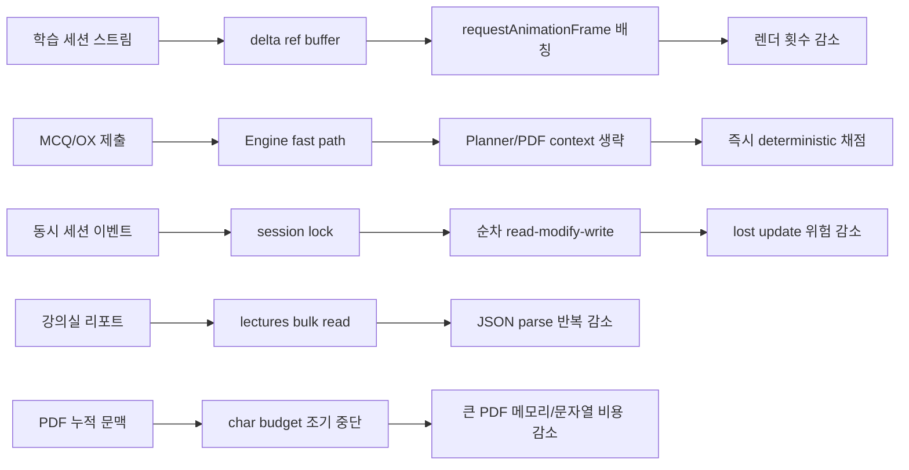
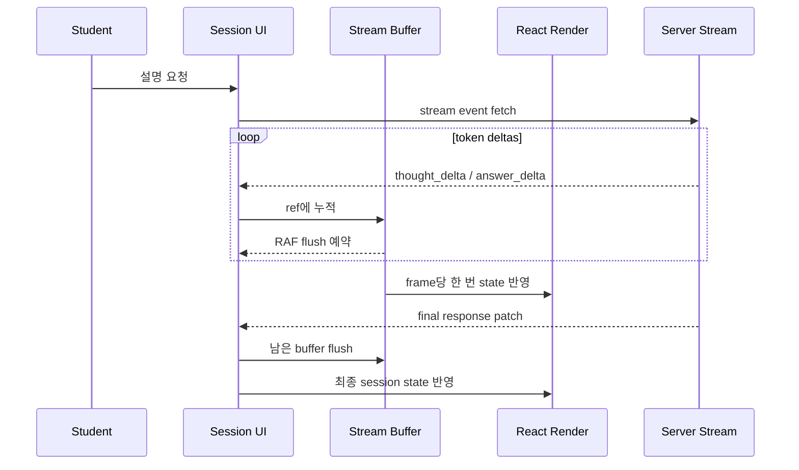
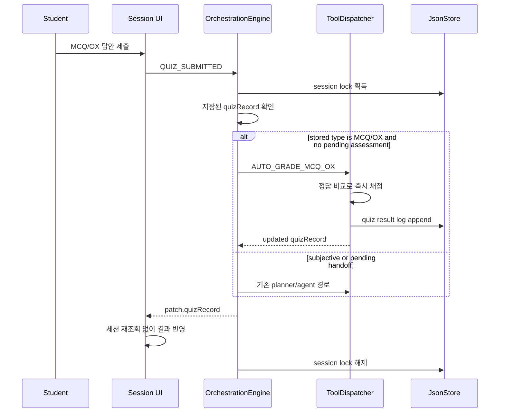
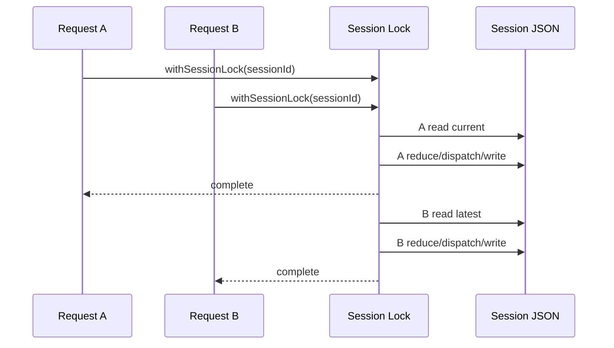
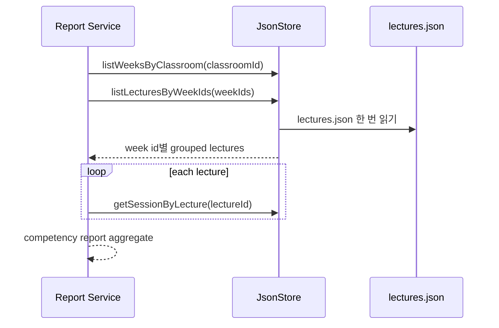
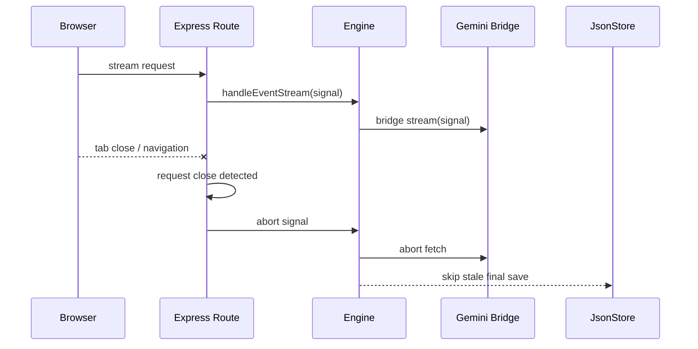
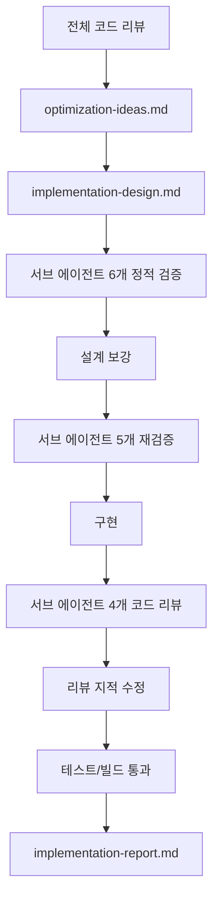

# Speed Optimization Implementation Report

작성일: 2026-04-25

## 한 줄 요약

새 기능을 추가하지 않고, 기존 학습 세션과 운영 흐름에서 불필요한 렌더링, AI/PDF 의존, JSON 반복 읽기, 동시 쓰기 충돌 가능성을 줄였다.

## 산출물

| 문서 | 역할 |
|---|---|
| `optimization-ideas.md` | 전체 코드 리뷰 후 속도/운영 최적화 후보 정리 |
| `implementation-design.md` | 구현 전 설계, 정적 검증 피드백 반영본 |
| `implementation-report.md` | 실제 구현 결과와 동작 변화 보고서 |

## 전체 변화 지도

## 무엇이 달라졌나

| 영역 | 이전 | 이후 |
|---|---|---|
| 스트리밍 UI | token delta마다 React state update | ref에 모은 뒤 animation frame마다 flush |
| 오래된 stream | 늦게 도착한 응답이 현재 화면을 덮을 수 있음 | run id, mounted guard, abort controller로 stale update 차단 |
| 객관식/OX 채점 | PDF fileRef/page context/LLM planner 경로를 탈 수 있음 | 저장된 quiz record 기준으로 즉시 deterministic 채점 |
| 채점 결과 반영 | 제출 후 세션을 다시 조회 | response patch의 `quizRecord`로 바로 반영 |
| PDF 누적 context | 현재 page까지 문자열을 모두 합친 뒤 자름 | char budget 도달 시 page 순회 중단 |
| 리포트 집계 | 주차마다 `lectures.json` 반복 읽기 | 한 번 읽어 week id별로 그룹핑 |
| JSON 저장 | no-op lock, 고정 `.tmp` 경로 | key별 Promise queue, 유니크 temp path |
| uploads PDF | 기본 static 응답 | `max-age=1d`, `immutable` 캐시 |

## 구현 범위

### Frontend

- `apps/web/src/routes/Session.tsx`
  - stream delta를 ref buffer에 누적하고 `requestAnimationFrame`으로 배칭했다.
  - 새 stream 시작 시 이전 stream을 abort하고, run id로 오래된 응답을 무시한다.
  - unmount 시 모든 pending RAF와 fetch를 정리한다.
  - MCQ/OX 제출 후 전체 세션 refetch 대신 patch의 `quizRecord`로 UI를 갱신한다.
  - `SAVE_AND_EXIT` 이후 중복 `saveSession()` 호출을 제거했다.
- `apps/web/src/components/chat/ChatPanel.tsx`
  - 사용자가 하단 근처에 있을 때만 자동 스크롤한다.
  - scroll RAF 실행 직전에도 pinned 상태를 다시 확인한다.
- `apps/web/src/components/chat/ChatBubble.tsx`
  - Markdown plugin 배열을 상수화하고 bubble 컴포넌트를 memo 처리했다.

### Backend

- `apps/server/src/routes/session.ts`
  - stream route에서 request close를 감지해 `AbortController`를 실행한다.
  - save route를 session lock 안에서 수행한다.
- `apps/server/src/services/engine/OrchestrationEngine.ts`
  - 같은 session id 이벤트를 session lock으로 직렬화한다.
  - MCQ/OX 제출 fast path에서 planner와 page context 생성을 건너뛴다.
  - abort된 stream은 stale final save를 하지 않는다.
  - 응답 patch에 갱신된 `quizRecord`를 포함한다.
- `apps/server/src/services/engine/ToolDispatcher.ts`
  - `AUTO_GRADE_MCQ_OX`를 PDF/Gemini guard 이전에 실행한다.
  - 클라이언트 payload가 아니라 저장된 quiz record의 type을 신뢰한다.
  - 비객관식 quiz는 deterministic 채점을 거부한다.
  - page 상태는 현재 page가 아니라 quiz가 만들어진 page 기준으로 갱신한다.
- `apps/server/src/services/storage/FileLock.ts`
  - no-op lock을 process-wide key별 Promise queue로 교체했다.
- `apps/server/src/services/storage/JsonStore.ts`
  - 개별 JSON 파일 read-modify-write와 session 단위 이벤트 저장에 file/session lock을 적용했다.
  - atomic write temp file을 pid/time/random 기반 유니크 경로로 바꿨다.
  - `listLecturesByWeekIds()`를 추가했다.
- `apps/server/src/services/pdf/PdfIngestService.ts`
  - bounded cumulative context helper를 추가했다.
- `apps/server/src/services/report/StudentCompetencyReportService.ts`
  - 리포트 집계에서 lecture bulk read를 사용한다.
- `apps/server/src/services/llm/GeminiBridgeClient.ts`, `apps/server/src/services/agents/*`
  - 세션 이벤트 stream 경로의 external abort signal을 전달한다.
- `apps/server/src/index.ts`
  - `/uploads` 정적 파일 캐시 옵션을 추가했다.

## 실제 동작 시나리오

### 시나리오 1. 긴 설명 스트리밍

운영 의미:

- 긴 답변에서 token 수만큼 렌더하지 않는다.
- Markdown 파싱과 스크롤 계산이 줄어 UI가 덜 버벅인다.

### 시나리오 2. 객관식/OX 퀴즈 제출

운영 의미:

- 객관식/OX 제출은 AI bridge나 PDF fileRef 상태에 덜 흔들린다.
- 제출 직후 추가 세션 조회가 없어 네트워크 왕복이 줄었다.
- 클라이언트가 quiz type을 잘못 보내도 저장된 quiz record 기준으로만 채점한다.

### 시나리오 3. 같은 세션에 이벤트가 동시에 들어오는 경우

운영 의미:

- 동일 세션에서 두 요청이 겹쳐도 뒤 요청은 앞 요청의 최신 저장 상태를 읽는다.
- JSON 저장소를 유지하면서 lost update 위험을 줄였다.

### 시나리오 4. 강의실 리포트 생성

운영 의미:

- 주차가 많아질수록 반복 파일 읽기와 JSON parse 비용을 줄인다.
- 리포트 결과 구조는 유지했다.

### 시나리오 5. 사용자가 스트리밍 중 페이지를 나감

운영 의미:

- 닫힌 스트림이 서버 리소스와 session lock을 불필요하게 오래 잡지 않는다.
- 사용자가 떠난 뒤 도착한 final response가 화면이나 저장 상태를 덮는 위험을 줄인다.

## 검증 과정

정적 검증에서 반영한 주요 보강:

- 단순 파일 write lock만으로는 세션 lost update를 막기 어렵기 때문에 `processEvent` 전체에 session lock을 적용했다.
- MCQ/OX fast path는 ToolDispatcher뿐 아니라 Engine 레벨에서 planner/page context를 우회하도록 설계했다.
- stream cleanup은 run-scoped cleanup과 unmount cleanup을 분리했다.
- 세션 이벤트 stream의 request close abort를 서버 fetch 경로와 GeminiBridgeClient stream fetch까지 전파했다.
- payload quiz type을 신뢰하지 않고 저장된 quiz record 기준으로 채점하도록 수정했다.
- 채점 실패 전 page 상태가 먼저 `QUIZ_GRADED`가 되지 않도록 reducer 책임을 조정했다.

## 테스트 결과

| 명령 | 결과 |
|---|---|
| `npm run test -w apps/server` | 통과, 12 test files / 51 tests |
| `npm run build` | 통과 |

추가/보강한 테스트:

- FileLock same-key serialization
- FileLock rejection 이후 queue continuation
- concurrent quiz-result append 보존
- bulk lecture grouping
- bounded PDF cumulative context
- MCQ/OX grading without Gemini file/page context
- non-objective stored quiz deterministic grading refusal
- OrchestrationEngine MCQ/OX fast path planner/page context skip
- OrchestrationEngine payload-only quiz type fast path refusal
- same-session concurrent event serialization
- report service bulk lecture read

## 남은 운영 리스크와 후속 후보

| 항목 | 상태 |
|---|---|
| 다중 Node process 또는 여러 서버 인스턴스 | 현재 lock은 단일 Node process 기준이다. 다중 인스턴스 운영은 DB/Redis/file advisory lock이 필요하다. |
| 여러 JSON 파일 cascade delete transaction | 완전한 DB transaction은 아니다. 이번 범위에서는 파일별 충돌과 세션 lost update를 줄이는 데 집중했다. |
| 초기 web bundle 크기 | build는 통과했지만 Vite large chunk warning이 남아 있다. route-level code splitting은 후속 후보로 유지한다. |
| background Gemini upload | 업로드 체감 속도 개선 가능성이 있지만 새 상태 설계가 필요해 이번 범위에서 제외했다. |

## 결론

이번 변경은 “새 기능”보다 “같은 기능을 더 빠르고 덜 흔들리게” 만드는 작업이다.

가장 큰 체감 개선 지점은 긴 스트리밍 답변 중 프론트 렌더 부담 감소와 MCQ/OX 제출의 deterministic fast path다.
운영 안정성 측면에서는 session lock과 JSON file lock으로 동시 요청에서 상태가 덮이는 위험을 줄였고, 리포트와 PDF context 생성의 반복 비용도 낮췄다.
