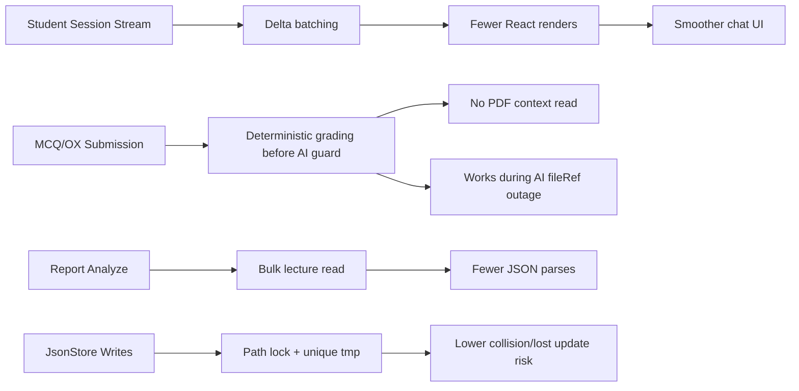

# Speed and Operational Optimization Ideas

## Summary

이 문서는 최적화 구현 전 코드 리뷰 기준으로 작성한 문제/아이디어 목록이다.
실제 반영 결과와 검증 결과는 `implementation-report.md`를 기준으로 본다.

이번 검토의 핵심은 새로운 학습 기능을 추가하는 것이 아니라, 현재 동작을 유지하면서 세션 응답 속도, 프론트 렌더링 비용, 파일 저장 안정성, 리포트 생성 비용을 줄이는 것이다.

현재 시스템은 `React Session UI -> Express OrchestrationEngine -> JsonStore -> AI Bridge -> Gemini` 흐름으로 동작한다. 체감 지연은 주로 두 곳에서 나온다.

- 학습 세션 중 작은 이벤트도 LLM planner와 PDF context 준비 경로를 지나가는 비용
- 스트리밍 delta마다 React state update와 Markdown render가 반복되는 비용

운영 리스크는 로컬 JSON 저장소의 동시 read-modify-write와 동일 `.tmp` 경로 atomic write에 집중되어 있다.

## Prioritized Ideas

### 1. Session Stream Delta Batching

문제:

- `Session.tsx`는 `thought_delta`와 `answer_delta`를 받을 때마다 `setStreamDrafts`를 호출한다.
- GRADER 스트림은 `setGradingInsight`도 delta마다 호출한다.
- `ChatPanel`은 messages 배열 변화마다 scroll effect를 실행한다.
- `ChatBubble`은 Markdown/KaTeX를 반복 파싱한다.

최적화:

- stream delta는 `ref` 버퍼에 누적한다.
- `requestAnimationFrame` 단위로 한 번만 React state에 flush한다.
- `ChatPanel` scroll trigger를 `messages.length`와 마지막 message id로 좁힌다.
- Markdown plugin 배열은 상수화하고 `ChatBubble`은 `memo`로 감싼다.

예상 효과:

- 긴 설명/채점 스트림 중 렌더 횟수 감소
- Markdown 재파싱과 스크롤 레이아웃 작업 감소

### 2. Deterministic MCQ/OX Grading Without AI/PDF Dependency

문제:

- `ToolDispatcher.executeTool()`은 lightweight tool 이후 모든 tool에 `geminiFile`을 요구한다.
- `AUTO_GRADE_MCQ_OX`는 완전 deterministic 채점인데도 `fileRef`와 page context가 없으면 실행되지 않는다.

최적화:

- `AUTO_GRADE_MCQ_OX`는 PDF/Gemini guard 이전에 실행 가능한 deterministic tool로 분리한다.
- page context resolve도 생략한다.

예상 효과:

- 객관식/OX 제출은 AI bridge 장애나 PDF fileRef 누락과 독립적으로 즉시 채점 가능
- 퀴즈 제출 hot path에서 불필요한 PDF index read 제거

### 3. Bounded PDF Cumulative Context

문제:

- `readCumulativeContext()`는 현재 페이지까지 모든 page text를 join한 뒤 마지막에 slice한다.
- 큰 PDF에서 퀴즈 생성 전 누적 문맥 생성 비용이 불필요하게 커질 수 있다.

최적화:

- char budget을 넘기면 page 순회를 조기 중단한다.
- 기존 반환 prefix는 유지한다.

예상 효과:

- 큰 PDF의 퀴즈 생성 준비 비용 감소
- 메모리 할당량 감소

### 4. Classroom Report Bulk Lecture Read

문제:

- 리포트 집계는 주차별로 `listLecturesByWeek()`를 호출한다.
- `JsonStore.listLecturesByWeek()`는 매번 `lectures.json` 전체를 다시 읽는다.

최적화:

- `JsonStore.listLecturesByWeekIds()`를 추가해 `lectures.json`을 한 번만 읽고 week id 기준으로 그룹핑한다.
- `StudentCompetencyReportService.aggregateClassroomSource()`는 주차 목록을 읽은 뒤 lecture bulk read를 사용한다.

예상 효과:

- 주차 수가 많을수록 리포트 생성 I/O와 JSON parse 횟수 감소

### 5. JsonStore Path Lock and Unique Temp Writes

문제:

- `FileLock`은 no-op이다.
- `atomicWrite()`는 같은 target에 대해 동일 `.tmp` 경로를 쓴다.
- 동시에 같은 JSON 파일을 수정하면 rename 충돌이나 lost update가 발생할 수 있다.

최적화:

- 경로별 promise queue 기반 `FileLock`을 구현한다.
- read-modify-write 작업은 파일 경로별 lock 안에서 수행한다.
- atomic temp file path는 pid/time/random 기반으로 유니크하게 만든다.

예상 효과:

- 운영 중 동시 요청에서 JSON 파일 손상과 쓰기 충돌 감소
- 파일 저장소 기반 데모 운영의 안정성 향상

### 6. Static PDF Cache Headers

문제:

- `/uploads` 정적 PDF는 기본 `express.static` 설정으로 제공된다.
- lecture PDF URL은 파일명이 lecture id 기반이라 업로드 후 변경되지 않는다.

최적화:

- 업로드 정적 파일에 `Cache-Control: public, max-age=86400, immutable`을 적용한다.

예상 효과:

- 세션 재진입과 페이지 reload 시 PDF 재검증 비용 감소

## Not Selected for This Iteration

### Full Deterministic Planner Fast Path

효과는 크지만 planner 우회는 이벤트별 교수 정책, assessment handoff, active intervention과의 상호작용을 더 크게 건드린다. 이번 목표가 속도 개선이더라도 회귀 위험이 상대적으로 높으므로 후속 최적화 후보로 남긴다.

### Route-level Code Splitting

초기 로드 JS 비용 감소 효과가 있지만 현재 요청의 핵심인 세션 실행 속도와 운영 안정성에 비해 우선순위가 낮다. 기능 파일 경계 변경도 넓어질 수 있어 이번 구현에서는 제외한다.

### Background Gemini Upload

업로드 체감 속도는 좋아지지만 lecture 생성 상태, AI 준비 상태, 재시도 UX를 새로 설계해야 한다. 이번에는 새 기능성 상태를 추가하지 않는다는 조건 때문에 제외한다.

## Expected Impact Map

