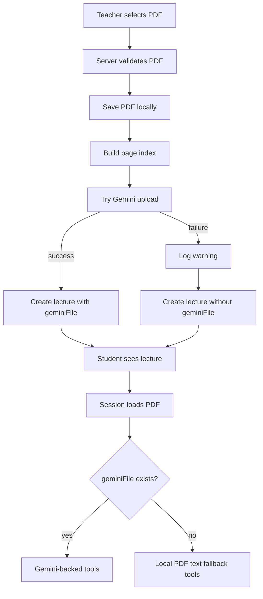

# Gemini Upload Fallback Implementation Design

## Summary

The browser test failed because Gemini PDF upload is treated as a required step in lecture creation. The fix is to make local PDF ingest the source of truth for lecture availability and make Gemini upload a best-effort enhancement. When `pdf.geminiFile` is missing, the learning session should continue through local PDF text fallback instead of stopping.

## Problem

In `apps/server/src/routes/lectures.ts`, the upload route currently performs:

1. PDF validation
2. local PDF save
3. page text index creation
4. Gemini PDF upload
5. lecture record creation

If step 4 fails, the route deletes the local artifacts and returns `502`. This blocks the whole classroom scenario even though the PDF and page index are already usable.

The second problem appears after lecture creation is allowed without Gemini. `OrchestrationEngine` already chooses deterministic planning when `fileRef` is missing, but `ToolDispatcher` currently blocks most learning tools with a system message when `lecture.pdf.geminiFile` is absent.

## Goals

- A teacher PDF upload succeeds when local PDF save and page-index creation succeed.
- Gemini upload failure does not delete local artifacts or block lecture creation.
- Lectures without `geminiFile` are visible to invited students.
- Student sessions for those lectures can load the PDF, explain a page, answer a question, generate a quiz, and grade quiz submissions.
- Gemini-backed behavior remains the preferred path whenever `pdf.geminiFile` exists.
- Students never trigger Gemini reconnect side effects.
- Raw provider/API-key errors are logged server-side, not shown directly in the student flow.

## Non-Goals

- Do not auto-create or modify external Gemini API keys.
- Do not replace Gemini-quality reasoning with an equally capable local model.
- Do not change auth, roles, classroom ownership, or invitation behavior.
- Do not introduce database migration requirements for this patch.

## Current System Snapshot

- `PdfIngestService` can validate PDF magic bytes, save a PDF, build a text index, and read page context.
- `GeminiBridgeClient.uploadPdf()` correctly throws when the bridge/provider rejects upload.
- `session.ts` already retries Gemini upload when a teacher opens a lecture without `geminiFile`; students do not retry.
- `OrchestrationEngine.planWithLlm()` falls back to deterministic orchestration when `fileRef` is absent.
- `ToolDispatcher.executeTool()` allows MCQ/OX deterministic grading without `fileRef`, but blocks explanation, QA, quiz generation, repair, and short/essay grading.

## Proposed Design

### 1. Lecture Creation Uses Local Ingest As Success Boundary

Change `POST /weeks/:weekId/lectures` in `apps/server/src/routes/lectures.ts`.

- Keep fatal failures for:
  - missing title
  - missing file
  - non-PDF extension or MIME type
  - invalid PDF signature
  - local PDF save failure
  - page index creation failure
- Make Gemini upload failure non-fatal:
  - catch the error
  - keep `fullPdfPath` and `indexPath`
  - log `[lecture_upload_ai_warning]` with `lectureId` and detailed server-side message
  - create the lecture with `geminiFile: undefined`
  - return `201` with `{ ok: true, data: lecture, warning?: string }`
  - the `warning` must be generic and must not include the raw provider/API-key error

This preserves the current success payload while adding an optional warning field that old frontend code can ignore.

Invalid/corrupt PDF failures remain fatal, but they should be controlled upload errors. The route should catch PDF signature and page-index/parser failures and return a 400-style message such as "유효한 PDF 파일을 업로드해 주세요." instead of exposing parser/internal error text.

### 2. Session AI Status Becomes Local-Mode Info

Change `apps/server/src/routes/session.ts`.

- Keep teacher reconnect attempt.
- If reconnect fails, log `[session_ai_reconnect_failed]`.
- Return `aiStatus.connected=false` with a non-blocking message:
  - "Gemini PDF 연결은 아직 준비되지 않았습니다. 로컬 PDF 텍스트 기반 기본 학습 모드로 진행합니다."
- Never interpolate the caught provider error into `aiStatus.message`.
- Student missing-`geminiFile` path returns the same local-mode message without retrying upload.

### 3. ToolDispatcher Adds Local PDF Text Fallback

Change `apps/server/src/services/engine/ToolDispatcher.ts`.

Keep existing Gemini-first path. Before the existing hard stop for missing `fileRef`, add local execution paths for provider-free tools.

Always-local tools must run before any `fileRef` guard:

- `APPEND_ORCHESTRATOR_MESSAGE`
- `APPEND_SYSTEM_MESSAGE`
- `PROMPT_BINARY_DECISION`
- `OPEN_QUIZ_TYPE_PICKER`
- `SET_CURRENT_PAGE`
- `WRITE_FEEDBACK_ENTRY`
- `AUTO_GRADE_MCQ_OX`

When `fileRef` is missing, add local fallback for these provider-backed tools:

- `EXPLAIN_PAGE`
- `ANSWER_QUESTION`
- `GENERATE_QUIZ_MCQ`
- `GENERATE_QUIZ_OX`
- `GENERATE_QUIZ_SHORT`
- `GENERATE_QUIZ_ESSAY`
- `GRADE_SHORT_OR_ESSAY`
- `REPAIR_MISCONCEPTION`

The fallback uses `getPageContext()` so it relies on the existing page index and respects page navigation.

#### EXPLAIN_PAGE

- Build deterministic Korean markdown:
  - local basic mode notice
  - core summary from page text
  - 3-5 key bullets
  - one study check question
- Update `pageState.status`, `explainSummary`, `explainMarkdown`, and `lastTouchedAt`.
- Append an `EXPLAINER` message.
- If text is empty, explain that the PDF text layer was not extractable and ask the learner to inspect the visible page.

#### ANSWER_QUESTION

- Use current page text plus neighbor text as context.
- Answer conservatively from extracted text only.
- If no grounded answer is available, say so and suggest checking the PDF page visually.
- Append a `QA` message.
- Preserve `appendQaThreadTurn()`.

#### GENERATE_QUIZ_*

- Create schema-valid `QuizJson`.
- Use page/cumulative quiz text when available.
- Generate deterministic questions:
  - MCQ: one correct local-summary choice plus distractors
  - OX: one statement grounded in extracted text
  - SHORT: ask for a concise summary or key term
  - ESSAY: ask for explanation/application based on the page
- Push a `QuizRecord`.
- Set `pageState.status = "QUIZ_IN_PROGRESS"`.
- Open the quiz modal and disable close as existing flow does.

#### GRADE_SHORT_OR_ESSAY

- Locate the quiz record.
- Use `ensurePageState(state, quizRecord.createdFromPage)` for grading state updates, not `args.page` or the current page.
- Resolve local grading context from `quizRecord.createdFromPage`; do not grade against `args.page` or `state.currentPage` when they differ from the quiz origin page.
- Use a simple deterministic scoring heuristic:
  - blank answer: 0
  - keyword overlap with prompt/reference/model answer/context: partial score
  - sufficiently long relevant answer: higher partial score
- Store `quizRecord.userAnswers` and `quizRecord.grading`.
- Update page state and quiz assessment using the existing assessment helpers.
- Append a `GRADER` message.
- Preserve repair/review prompts when score is below pass threshold.

#### REPAIR_MISCONCEPTION

- When an active repair intervention exists, produce a short local repair message using:
  - focus concepts
  - suspected misconceptions
  - student reply
  - current page text
- Apply the existing memory write and transition `activeIntervention.stage` to `REPAIR_DELIVERED`.
- Prompt for retest as the current Gemini path does.

### 4. Frontend Copy

Minimal frontend changes are optional for correctness. Add only low-risk hints:

- In `Classroom.tsx`, show a small `기본 모드` note for lectures where `!lecture.pdf.geminiFile`.
- In `Session.tsx`, the existing `!aiStatus.connected` banner remains, but the backend message no longer reads as a fatal error.

## Data and Control Flow

## Failure Handling

- Gemini upload failure at lecture creation: warning only, lecture still created.
- Gemini reconnect failure at teacher session entry: warning only, local mode still works.
- Student session without Gemini: no side effect, local mode message.
- Invalid PDF or page index failure: controlled fatal upload error because the system cannot reliably render/index the material; return sanitized 400-level user copy.
- Empty extracted text: PDF still loads, local tools explain the limitation.
- Tool execution failures: append a generic user-facing message and log detailed provider/internal error server-side. Do not put raw provider text in chat messages.
- Stream-level failures after headers are sent: write a generic NDJSON `error` message to the client and log the detailed exception server-side.

## Test Strategy

- Upload route:
  - Gemini upload throws, route returns `201`, lecture exists, local files remain.
  - The warning is generic and does not contain the thrown provider/API-key text.
  - Invalid PDF signature or parser failure returns a controlled 400-level upload error.
- Session route:
  - Student opens lecture without `geminiFile`, receives `200`, `pdfUrl`, and local-mode `aiStatus`.
  - Teacher reconnect failure returns a generic local-mode `aiStatus.message` and does not include provider text.
- Dispatcher:
  - Missing `geminiFile` `EXPLAIN_PAGE` appends `EXPLAINER` and sets page explained.
  - Missing `geminiFile` `ANSWER_QUESTION` appends `QA` and updates QA thread.
  - Missing `geminiFile` `GENERATE_QUIZ_MCQ` opens modal with valid quiz.
  - Missing `geminiFile` `GRADE_SHORT_OR_ESSAY` creates grading and assessment.
  - `WRITE_FEEDBACK_ENTRY` runs without `geminiFile` and does not emit a Gemini-missing error.
  - Provider-backed tool failures do not append raw provider error text to chat.
  - Existing MCQ/OX deterministic grading still passes.
- Engine-level local mode:
  - Missing `geminiFile` `START_EXPLANATION_DECISION` follows deterministic planning, reads local page context, and produces a local explanation.
  - Missing `geminiFile` `QUIZ_TYPE_SELECTED` produces a local quiz modal through the real `OrchestrationEngine` path.
- Stream route:
  - Escaped stream errors are reported to the client with generic copy, while detailed errors stay in server logs.
- Build:
  - `npm test --workspace apps/server`
  - `npm run build --workspace apps/server`
  - `npm run build --workspace apps/web`
- Manual Comet:
  - teacher upload with invalid Gemini key
  - student lecture visibility
  - student session PDF rendering
  - page explanation
  - quiz generation and submission

## Scenario Changes

### Before

- Gemini API key invalid.
- Teacher uploads PDF.
- Upload returns `502`.
- Lecture does not appear.
- Student cannot test material/session/explanation/quiz.

### After

- Gemini API key invalid.
- Teacher uploads PDF.
- Upload returns `201`; lecture appears with local-mode capability.
- Student sees and opens the lecture.
- PDF viewer works.
- Explanation and quiz run through local PDF text fallback.

## Open Risks

- Local fallback quality is intentionally simpler than Gemini.
- Scanned/image-only PDFs may have sparse text extraction.
- Subjective grading is heuristic and should be treated as basic feedback.
- Repeated teacher reconnect attempts can be noisy if a teacher refreshes often; log volume should be watched.
