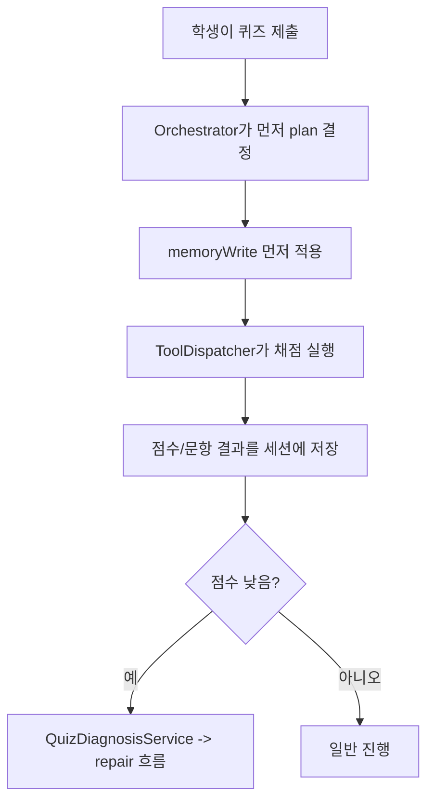
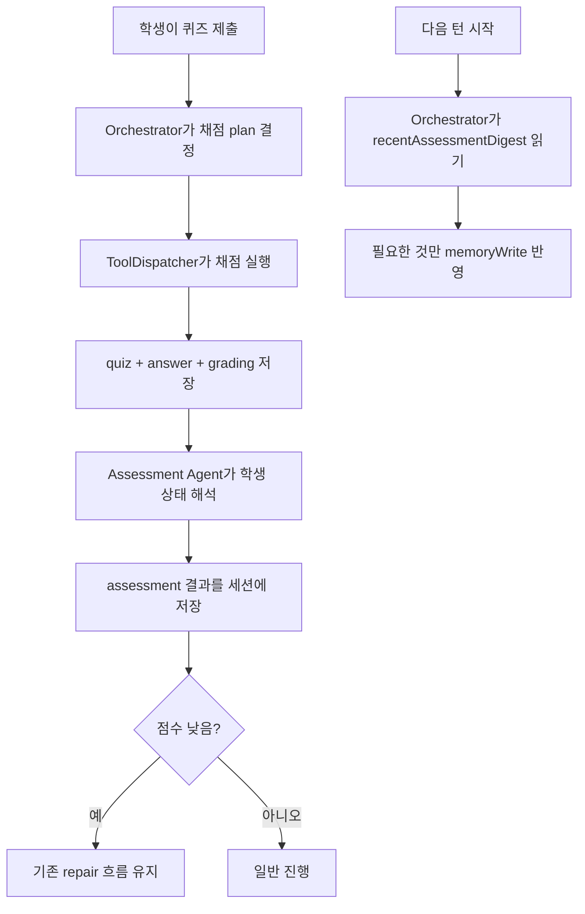

# Assessment Handoff Planner (Ver4 Draft)

- 시간: `2026-04-16`
- 상태: `구현 전 계획서`
- 범위: `채점 후 assessment를 세션에 저장하고, 다음 턴 Orchestrator가 이를 읽어 memoryWrite에 반영하는 구조`
- 목표: `시험 결과를 단순 점수 처리로 끝내지 않고, 학생의 강점·약점·서술형 성향 같은 신호를 다음 학습 흐름에 더 잘 반영하기`

## 한 줄 요약

Ver4의 핵심은 이겁니다.

`채점 결과를 바로 메모리에 억지로 넣지 말고, 먼저 assessment로 정리해서 세션에 저장한 뒤, 다음 턴 Orchestrator가 그것을 읽고 필요한 것만 memoryWrite로 반영한다.`

이 방식이 현재 구조와 가장 잘 맞습니다.

## 왜 이 버전을 하려는가

지금 구조는 퀴즈를 채점한 뒤에도
주로 아래 정도만 남습니다.

- 점수
- 문항별 정오답
- 짧은 summary
- 저득점이면 repair 진입

이 구조만으로도 `틀렸는가`는 볼 수 있습니다.
하지만 아래 같은 것은 오래 남기기 어렵습니다.

- 이 학생이 어떤 개념은 잘하고 어떤 개념은 약한지
- 서술형에서 설명을 적극적으로 하는지
- 답은 틀렸지만 사고 방향은 좋은지
- 같은 실수가 반복되는지
- confidence 숫자보다 더 믿을 만한 학습 신호가 무엇인지

즉, 지금 시스템은 `채점`은 잘하지만
`채점 결과를 학습자 이해로 바꾸는 중간 해석 단계`가 약합니다.

## 현재 구조 설명

현재 흐름은 대략 이렇게 움직입니다.



이 구조의 장점:

- 지금도 단순하고 안정적입니다.
- 저득점 후 repair 흐름은 이미 잘 붙어 있습니다.
- 퀴즈 원본, 답안, 채점 결과 자체는 세션에 저장됩니다.

이 구조의 한계:

- 채점 뒤에 `학생 상태를 해석하는 단계`가 없습니다.
- Orchestrator는 다음 턴에 점수 요약 정도만 보기 쉽습니다.
- 강점/약점/서술형 성향을 구조적으로 남기기 어렵습니다.

## 바뀔 구조 설명

Ver4에서는 채점 뒤에 `assessment 단계`를 하나 추가합니다.

중요한 점은:
이 assessment는 `repair를 대체`하는 것이 아니라,
`repair와 별도로 학생 상태를 정리해 두는 보조 레이어`입니다.

추천 구조는 아래와 같습니다.



즉 바뀌는 포인트는 이것입니다.

- 이전: `채점 -> 점수 처리 -> 끝 또는 repair`
- 변경: `채점 -> assessment 저장 -> 다음 턴부터 더 똑똑한 Orchestrator`

## 핵심 아이디어

이번 버전은 `메모리를 바로 쓰는 버전`이 아니라
`메모리를 쓰기 전에 assessment를 한 번 거치는 버전`입니다.

이렇게 하면 좋은 점이 있습니다.

### 1. 현재 엔진 구조와 충돌이 적다

지금 엔진은 같은 턴에 Orchestrator를 두 번 돌리는 구조가 아닙니다.
그래서 `채점 직후 즉시 Orchestrator 재호출`은 부담이 큽니다.

반면,
`assessment를 세션에 저장 -> 다음 턴 Orchestrator가 읽기`
방식은 현재 단일 패스 구조와 더 잘 맞습니다.

### 2. 해석과 정책 결정을 분리할 수 있다

- assessment agent: `학생 상태를 읽고 정리`
- orchestrator: `그중 무엇을 메모리에 남기고 이번 턴에 어떻게 쓸지 결정`

이렇게 나누면 역할이 깔끔해집니다.

### 3. repair와 충돌이 줄어든다

assessment는
`학생의 상태를 기록하는 역할`
중심으로 두고,

repair는
`오답 직후 실제 교정 행동`
을 계속 맡기면 됩니다.

## 시스템이 어떻게 바뀌는가

사용자 입장에서는 갑자기 복잡해지는 것이 아닙니다.
오히려 더 자연스러워집니다.

### 이전의 느낌

```text
퀴즈 제출
-> 점수 확인
-> 틀리면 바로 진단/복습
-> 다음 턴에서는 그 시험의 의미가 많이 압축됨
```

### Ver4의 느낌

```text
퀴즈 제출
-> 시스템이 점수뿐 아니라 답안의 성격도 한 번 정리
-> 그 결과를 저장
-> 다음 질문/설명/퀴즈에서 학생 특성을 더 잘 반영
```

즉,
`시험이 끝나면 그냥 점수만 남는 시스템`에서
`시험이 끝나면 학생 이해 정보도 남는 시스템`으로 바뀝니다.

## 가장 중요한 시나리오 변화

아래 시나리오가 이번 Planner의 핵심입니다.

### 시나리오 A: 서술형에서 답은 틀렸지만 사고 방향은 좋은 학생

이전:

```text
학생 서술형 제출
-> 점수 낮음
-> "기준 미달"
-> repair 또는 복습
```

변경 후:

```text
학생 서술형 제출
-> 채점
-> assessment가 "정답은 틀렸지만 설명 구조는 살아 있음"으로 해석
-> 세션에 저장
-> 다음 턴 Orchestrator가
   "이 학생은 개념은 흔들리지만 설명 의지는 좋다"를 반영
-> 이후 설명은 더 짧은 정리 + 개념 보정 중심으로 진행
```

체감 변화:

- 이전에는 `틀렸다`가 중심
- 이제는 `어떻게 틀렸는가`까지 다음 턴에 반영

### 시나리오 B: 객관식은 맞지만 특정 개념군에서 반복적으로 흔들리는 학생

이전:

```text
시험마다 개별 점수는 저장됨
-> 반복 약점은 일부 잡히지만, 주로 저득점 repair 중심
```

변경 후:

```text
퀴즈 결과 누적
-> assessment가 "확률 계산은 반복적으로 흔들림" 같은 패턴 정리
-> 세션에 assessment로 저장
-> 다음 턴 Orchestrator가 memoryWrite에 반영
-> 이후 퀴즈나 설명이 그 개념을 더 자주 의식
```

체감 변화:

- 이전에는 `그때그때 틀린 문제`
- 이제는 `누적된 약한 개념 축`

### 시나리오 C: 학생이 퀴즈 후 자유 질문을 하는 경우

이전:

```text
학생: "이 부분 다시 설명해 주세요"
-> QA/설명은 현재 메모리와 페이지 문맥 위주로 응답
-> 방금 시험에서 드러난 세부 특성은 반영이 약함
```

변경 후:

```text
학생: "이 부분 다시 설명해 주세요"
-> 직전 assessment가 이미 세션에 저장됨
-> Orchestrator가 다음 턴에 그것을 읽고 memoryWrite 반영
-> QA/설명은 "이 학생은 적용 이유를 자주 헷갈림"을 더 잘 반영
```

체감 변화:

- 이전에는 `직전 시험이 바로 다음 질문에 약하게 연결`
- 이제는 `직전 시험 해석이 다음 질문에 자연스럽게 연결`

### 시나리오 D: 저득점 후 repair가 필요한 경우

이전:

```text
저득점
-> QuizDiagnosisService
-> repair
```

변경 후:

```text
저득점
-> 채점 결과 저장
-> assessment도 같이 저장
-> 기존 QuizDiagnosisService로 repair 진행
-> 다음 턴부터는 assessment까지 반영된 더 풍부한 memory 활용
```

핵심:

이번 Ver4는 repair를 없애는 것이 아닙니다.
repair는 계속 유지하고,
그 위에 `학습자 해석 레이어`를 하나 더 얹는 구조입니다.

## 시스템 내부에서 바뀌는 역할

이번 Planner 기준으로 각 구성요소의 역할은 이렇게 정리할 수 있습니다.

| 구성요소 | 현재 역할 | Ver4 역할 |
|---|---|---|
| `Grader` | 채점 | 그대로 채점 |
| `Assessment Agent` | 없음 | 시험 결과를 학생 이해 정보로 해석 |
| `Session` | quiz/grading 저장 | quiz/grading + assessment 저장 |
| `Orchestrator` | 점수/메모리 요약 중심 판단 | assessment까지 읽고 memoryWrite 판단 |
| `QuizDiagnosisService` | 저득점 repair 진입 | 그대로 유지 |

## 이번 버전에서 특히 좋은 점

이번 버전은 아래 이유로 현실적입니다.

### 1. same-turn 재오케스트레이션을 강요하지 않는다

현재 구조를 크게 흔드는 포인트를 피합니다.

### 2. 점수 중심 시스템을 학습자 이해 중심 시스템으로 확장한다

점수는 그대로 쓰되,
그 점수의 의미를 assessment가 해석해 줍니다.

### 3. 구현 범위를 적당히 제한할 수 있다

처음부터 거대한 mastery graph를 만들 필요 없이,
`assessment 저장 -> digest 읽기 -> memoryWrite`
만 붙여도 체감 개선이 큽니다.

## 이번 Planner에서 의도적으로 크게 하지 않는 것

이번 문서 기준으로는 아래까지 한 번에 하지는 않습니다.

- 개념 그래프 전체 재설계
- memory를 확률 그래프로 전면 교체
- repair를 assessment agent로 대체
- 같은 턴에 Orchestrator를 두 번 돌리는 대규모 엔진 재작성

즉,
이번 Ver4는 `큰 구조 혁신`보다
`현재 구조에 잘 붙는 해석 레이어 추가`
에 집중합니다.

## 구현 방향의 큰 덩어리

구현 세부를 깊게 쓰지는 않지만,
큰 덩어리로 보면 아래 순서입니다.

1. 채점 뒤 assessment 결과를 담을 새 구조를 만든다.
2. assessment agent가 `quiz/problem/answer/grading`을 읽고 학생 상태를 정리한다.
3. 그 결과를 세션에 저장한다.
4. 다음 턴 Orchestrator 프롬프트에 assessment digest를 넣는다.
5. Orchestrator가 필요한 것만 memoryWrite에 반영한다.

## 최종 권장안

이번 Ver4의 권장안은 명확합니다.

```text
채점
-> assessment 저장
-> 다음 턴 Orchestrator가 assessment 읽기
-> memoryWrite 반영
```

이 버전이 좋은 이유:

- 현재 구조와 가장 잘 맞음
- repair와 충돌이 적음
- 테스트 전략도 세우기 쉬움
- 나중에 더 고도화하기 위한 중간 단계로도 좋음

## 한 줄 결론

Ver4는 `시험이 끝난 뒤 학생 상태를 한 번 더 해석해서 남기는 단계`를 추가하는 버전입니다.

그래서 시스템은
`채점하는 시스템`
에서
`채점 결과를 바탕으로 학생을 더 잘 이해하는 시스템`
으로 한 단계 올라가게 됩니다.
