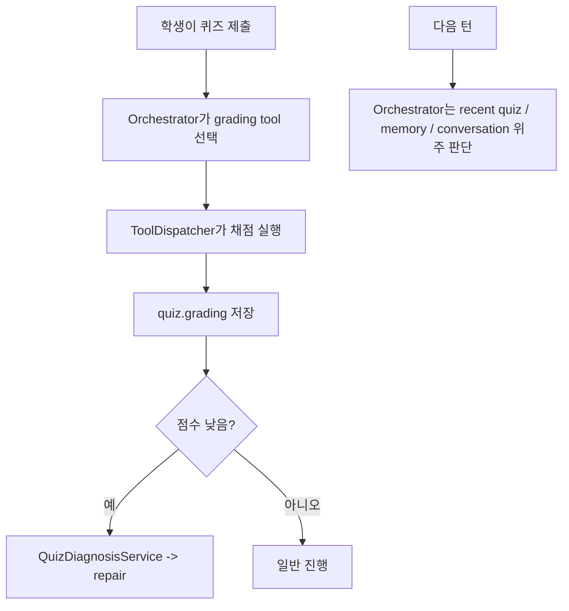
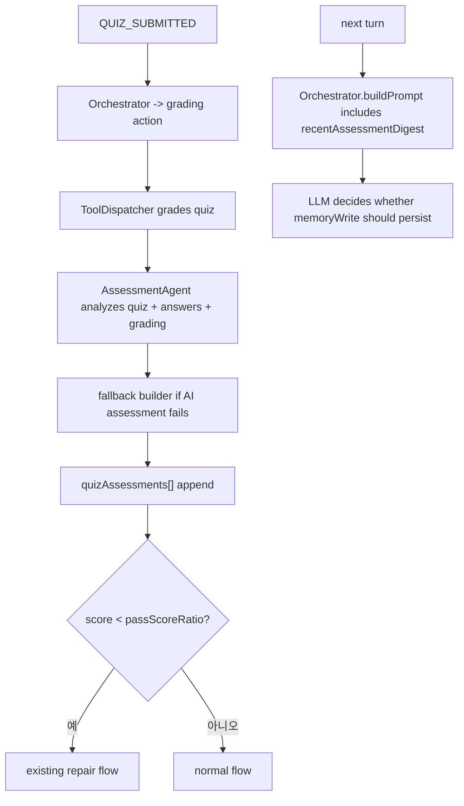
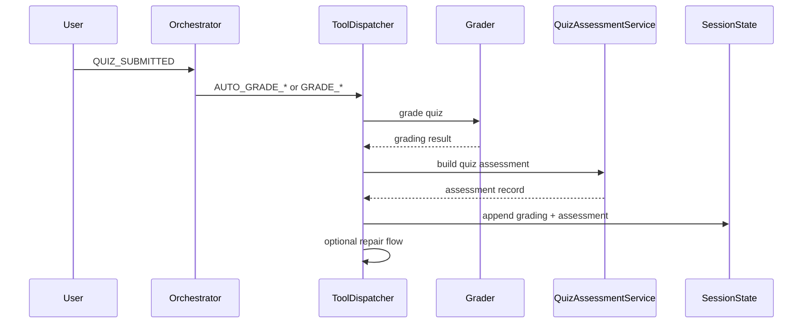
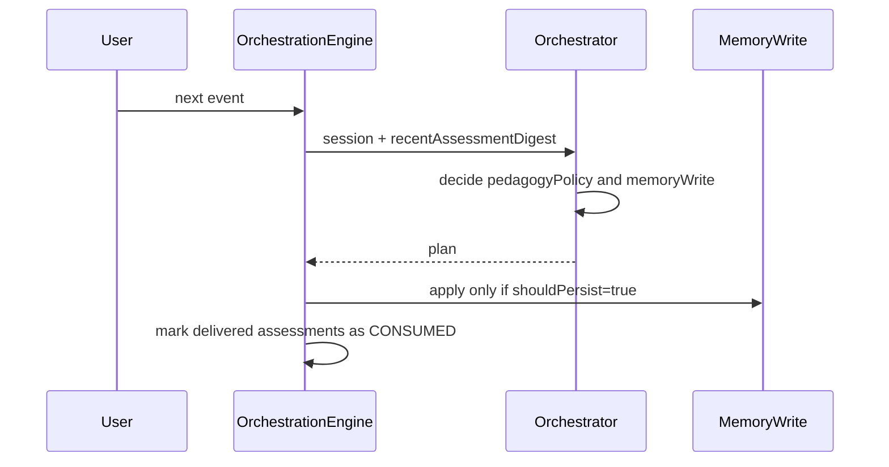

# Implementation Design

## Summary

Ver4 Planner를 현재 엔진 구조에 맞게 구현하는 목표는 다음과 같습니다.

- 퀴즈 채점 직후 `assessment`를 생성해 세션에 저장한다.
- `assessment`는 같은 턴에 바로 memory에 쓰지 않는다.
- 다음 턴 `Orchestrator`가 최근 assessment digest를 읽고, 필요한 경우에만 `memoryWrite`로 반영한다.
- 기존 `repair` 흐름은 그대로 유지한다.

이번 구현은 안정성을 위해 `deterministic assessment artifact`를 먼저 도입한다.
즉, 현재 grading 결과와 기존 repair 신호를 바탕으로 assessment를 구조화해 세션에 저장하고, 다음 턴 Orchestrator가 이를 handoff artifact로 소비한다.
LLM 기반 Assessment Agent는 향후 교체 가능한 확장 포인트로 남기되, 이번 컷의 필수 범위에는 넣지 않는다.

## Problem

현재 시스템은 퀴즈 채점 결과를 잘 저장하지만, 그 결과를 "학생 이해 정보"로 해석해 다음 턴 개인화 판단에 재사용하는 중간 레이어가 부족하다.

현재 남는 정보:

- 점수
- 문항별 정오답
- grading summary
- 저득점 시 repair 진입 정보

현재 부족한 정보:

- 어떤 개념군이 강점/약점인지
- 답은 틀렸지만 사고 방향이 괜찮았는지
- 서술형에서 설명 의지나 구조화 성향이 드러났는지
- 반복적으로 흔들리는 패턴이 있는지
- 다음 설명이나 퀴즈 난이도에 반영할 학습 신호가 무엇인지

## Goals / Non-goals

### Goals

- `SessionState`에 assessment 기록을 영속 저장한다.
- 채점 직후 assessment를 자동 생성한다.
- 다음 턴 `Orchestrator` 프롬프트에 assessment digest를 주입한다.
- `memoryWrite`는 assessment를 참고하되, 과잉 추론 없이 필요한 최소 신호만 반영한다.
- 기존 `QuizDiagnosisService` 기반 repair 경로와 충돌하지 않게 유지한다.
- 구버전 세션 JSON도 안전하게 로드되도록 한다.

### Non-goals

- same-turn 재오케스트레이션 추가
- mastery graph 전면 개편
- repair를 assessment로 대체
- memory schema 전면 교체
- 프론트 UI에 assessment 전용 화면 추가

## Current System Snapshot

현재 핵심 흐름은 아래와 같다.



현재 구조의 중요한 제약:

- `OrchestrationEngine`은 `plan.memoryWrite`를 dispatch 전에 같은 턴에 바로 적용한다.
- `ToolDispatcher`의 채점 분기가 실제 grading 결과를 세션에 기록한다.
- `Orchestrator` 프롬프트에는 recent quiz digest는 있지만 recent assessment digest는 없다.

따라서 Ver4는 assessment를 "같은 턴 즉시 memory 반영"이 아니라 "다음 턴 소비용 세션 artifact"로 둬야 현재 구조와 충돌하지 않는다.

## Proposed Design

### High-level Structure



### Core Decision

assessment는 별도 artifact로 둔다.

- `grading`: 점수와 문항 판정
- `repair`: 저득점 직후 교정 행동
- `assessment`: 다음 턴 개인화에 쓸 학습자 해석 신호

이 분리를 유지해야 저득점 케이스에서 같은 약점이 과도하게 중복 반영되지 않는다.

### Assessment Generation Strategy

1. 채점이 완료되면 `QuizAssessmentService`가 다음 입력을 읽는다.

- `quizJson`
- `userAnswers`
- `grading`
- `current integratedMemory`
- 최근 퀴즈 일부
- 현재 `activeIntervention` 여부

2. service는 구조화된 `QuizAssessmentRecord`를 생성한다.

3. 생성된 assessment는 `SessionState.quizAssessments`에 append 한다.

4. 다음 턴 `Orchestrator`는 최근 pending assessment digest를 읽고, 이번 이벤트에서 실제로 필요한 경우에만 `memoryWrite`를 낸다.

5. 성공적으로 prompt handoff가 끝난 assessment는 `CONSUMED`로 마킹한다.

## Module Changes

### 1. Domain

`apps/server/src/types/domain.ts`

- `QuizAssessmentRecord` 타입 추가
- assessment의 핵심 handoff를 위한 `deliveryStatus`, `consumedAt`, `source`, `memoryHint` 같은 보조 필드 추가
- `SessionState.quizAssessments?: QuizAssessmentRecord[]` 추가

권장 assessment 필드:

- `id`
- `quizId`
- `page`
- `quizType`
- `version`
- `createdAt`
- `source`
- `scoreRatio`
- `deliveryStatus`
- `consumedAt`
- `readiness`
- `strengths`
- `weaknesses`
- `misconceptions`
- `behaviorSignals`
- `memoryHint`
- `summaryMarkdown`
- `evidence`

### 2. Assessment Service

새 파일:

- `apps/server/src/services/engine/QuizAssessmentService.ts`

역할:

- `buildQuizAssessment()`
- `preparePendingAssessmentHandoff()`
- `selectPendingAssessments()`
- `markAssessmentsConsumed()`
- `upsertQuizAssessment()`
- `sanitizeAssessmentText()`
- assessment observability 로그 payload 생성

이번 버전은 parser/LLM assessment agent를 추가하지 않는다.
deterministic service 하나로 assessment 생성과 handoff digest를 모두 담당한다.

### 3. Dispatcher Integration

`apps/server/src/services/engine/ToolDispatcher.ts`

채점 분기 두 곳에 동일하게 assessment 생성 로직을 삽입한다.

- `AUTO_GRADE_MCQ_OX`
- `GRADE_SHORT_OR_ESSAY`

순서:

1. grading 저장
2. branch-local deterministic assessment 생성
3. `quizAssessments[]` upsert
4. `[assessment]` structured log 출력
5. 기존 repair 여부 판단

즉, assessment는 repair 전에 저장되지만 repair를 대체하지 않는다.
또한 assessment 생성 오류가 생겨도 repair 판단은 계속 진행되도록 branch-local 예외 처리로 감싼다.

### 4. Orchestrator Consumption

`apps/server/src/services/agents/Orchestrator.ts`
`apps/server/src/types/orchestrator.ts`
`apps/server/src/services/engine/OrchestrationEngine.ts`

추가 사항:

- `OrchestratorInput.assessmentDigest?: string`
- `buildPrompt()`에 recent assessment 섹션 추가
- instruction에 "assessment는 다음 턴 memoryWrite 후보를 좁히는 보조 신호"라는 규칙 명시

핵심 규칙:

- 같은 assessment를 통째로 memoryWrite에 복사하지 않는다.
- `strengths`, `weaknesses`, `misconceptions`, `explanationPreferences`, `preferredQuizTypes`, `targetDifficulty`, `nextCoachingGoals` 중 필요한 것만 사용한다.
- repair가 막 끝난 직후에는 repair와 assessment가 동일 신호를 중복 반영하지 않도록 신중히 판단한다.
- 단일 assessment 하나만으로 `learnerLevel`과 `confidence`를 바꾸지 않도록 프롬프트에서 제한한다.

### 5. Storage / Backward Compatibility

`apps/server/src/services/storage/JsonStore.ts`

변경:

- `getSession()`에서 `quizAssessments` 기본값 `[]` 보정
- `createSession()`에서 `quizAssessments: []` 초기화

`apps/server/src/routes/session.ts`

변경:

- `/session/:sessionId/save`는 client state를 더 이상 세션에 merge 하지 않는다.
- save route는 서버 세션을 그대로 다시 저장하고 `updatedAt`만 갱신한다.
- client가 state를 보내도 warning log만 남기고 무시한다.

이번 버전에서는 `schemaVersion`을 유지한다.
이유는 대규모 저장 포맷 마이그레이션보다 field-level backward compatibility가 더 안전하기 때문이다.

## Data and Control Flow

### Assessment Creation



### Next-turn Consumption



Assessment handoff 규칙:

- 새 assessment는 `deliveryStatus=PENDING`으로 저장한다.
- `OrchestrationEngine`는 planning 직전에 `PENDING` assessment만 digest로 묶는다.
- 같은 이벤트 처리에서 prompt에 실린 assessment는 저장 직전에 `CONSUMED`로 마킹한다.
- 이미 `CONSUMED`인 assessment는 일반 recency 참고에는 쓸 수 있어도, "다음 턴 handoff" 전용 digest에는 다시 넣지 않는다.
- 따라서 Ver4의 핵심 handoff는 "성공적으로 commit된 턴" 기준의 best-effort one-shot delivery를 따른다.
- 단일 end-of-turn save가 실패하면 consumed marker도 함께 저장되지 않으므로, 이 보장은 commit 성공 경로에 한정된다.

## Failure Handling

### Assessment Generation Failure

- assessment 생성은 grading/repair와 다른 branch-local 보호 구간으로 둔다.
- assessment 생성 실패 시에는 `[assessment_fallback]` 또는 warning 로그를 남기고, grading과 repair는 계속 진행한다.
- assessment 레코드가 완전하지 않으면 세션에 저장하지 않는다.

### Digest Size Control

- prompt에는 최근 pending assessment 1~2개만 넣는다.
- 전체 assessment digest는 400~600자 정도로 제한한다.
- 각 assessment는 allowlist 기반 요약형 digest로 압축한다.
- evidence와 summary는 sanitize 후 짧은 문장 단위로 잘라 전달한다.

### Repair Collision Prevention

- assessment는 repair 이전에 저장 가능하지만, `activeIntervention` 상태를 덮어쓰지 않는다.
- repair memory와 assessment 신호가 같은 의미를 가질 때는 Orchestrator가 다음 턴에 보수적으로 memoryWrite를 고르게 프롬프트를 조정한다.

### Backward Compatibility

- 기존 세션 파일에 assessment가 없어도 로드 시 `[]`로 보정한다.

## Test Strategy

### Unit

- deterministic assessment builder가 점수/오답/서술형 성향을 안정적으로 추출하는지 테스트
- assessment digest가 길이 제한과 핵심 신호 선택 규칙을 지키는지 테스트
- pending selection과 consumed marking이 idempotent한지 테스트

### Integration

- 채점 후 assessment가 세션에 저장되는지
- assessment 추가 후에도 저득점 repair가 그대로 열리는지
- 다음 턴 Orchestrator 프롬프트에 assessment digest가 포함되는지
- `/session/:sessionId/save`가 assessment를 덮어쓰지 않는지

### Persistence

- 새 세션 생성 시 `quizAssessments`가 초기화되는지
- 구버전 세션 JSON 로딩 시 `quizAssessments`가 보정되는지

### Regression

- 기존 `orchestratorFlow`
- 기존 `toolDispatcher`
- 기존 `jsonStore`
- 기존 `schema`

## Scenario Changes

### Before

```text
서술형 오답
-> 점수와 grading summary 저장
-> 필요하면 repair
-> 다음 턴에는 시험 결과의 의미가 압축된 채 남음
```

### After

```text
서술형 오답
-> grading 저장
-> assessment가 "개념은 흔들리지만 설명 구조는 살아 있음" 같은 신호 저장
-> 필요하면 repair 유지
-> 다음 턴 Orchestrator가 그 assessment를 읽고
   설명 깊이, memoryWrite, 다음 코칭 포인트를 더 정교하게 판단
```

### User-facing Benefits

- 점수만이 아니라 "어떻게 틀렸는가"가 다음 턴에 반영된다.
- 서술형의 질적 신호가 사라지지 않는다.
- 반복 약점 축을 점진적으로 memory로 승격할 수 있다.

## Open Risks

- assessment와 repair가 같은 약점을 동시에 보고할 수 있다.
- prompt가 길어지면 Orchestrator 판단 품질이 오히려 떨어질 수 있다.
- 아직 UI에서 assessment를 직접 보여주지 않으므로 초반 검증은 로그와 세션 JSON 중심이 된다.
- 단일 퀴즈 결과를 memory에 과도하게 승격하지 않도록 prompt와 테스트로 계속 제어해야 한다.

## Implementation Order

1. domain/storage/guard 계약 추가
2. deterministic assessment service 추가
3. ToolDispatcher 채점 분기에 assessment 저장 연결
4. Orchestrator prompt에 recentAssessmentDigest 주입
5. one-shot consumed marking 연결
6. save route 보호, 테스트와 회귀 검증
7. 최종 구현 후 이 문서를 코드 현실에 맞게 갱신
