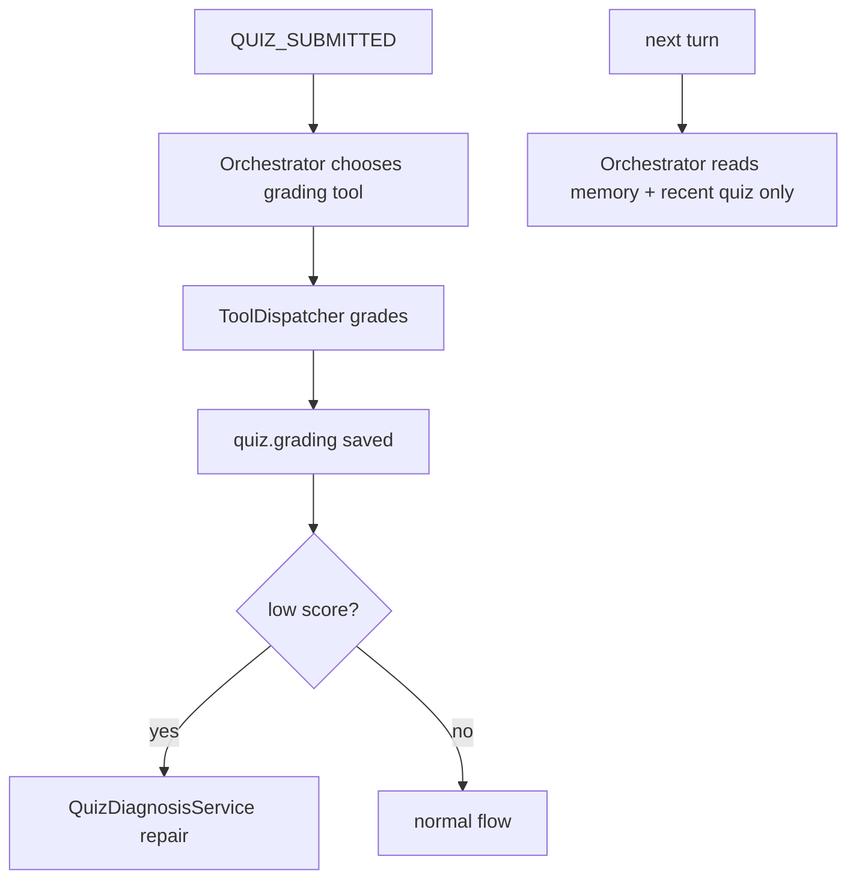
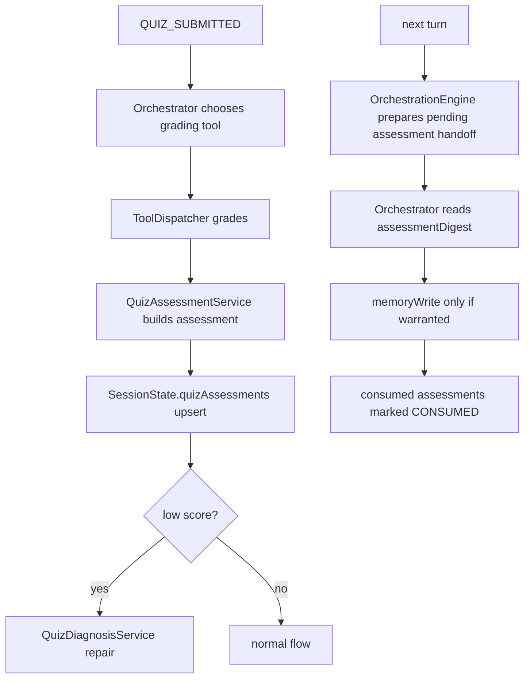

# Implementation Report

## 한눈에 보기

이번 Ver4 구현의 핵심은 아래 한 줄입니다.

`채점 결과를 deterministic assessment artifact로 세션에 저장하고, 다음 orchestration turn에서만 handoff digest로 읽어 memoryWrite 판단에 반영한다.`

즉 시스템은 이제 단순히 점수만 남기는 구조가 아니라, 퀴즈 결과를 `학생 이해 신호`로 한 번 더 정리해 다음 턴 개인화 판단에 연결하는 구조가 되었습니다.

이번 컷은 안정성을 우선해서 `LLM assessment agent`가 아니라 `deterministic assessment service`로 구현했습니다.
대신 아래 세 가지를 확실히 만들었습니다.

- assessment 세션 저장
- 다음 턴 handoff digest 소비
- 기존 repair 흐름과의 안전한 공존

## 구조 변화

### Before



### After



## Code Update Summary

이번 구현에서 실제로 바뀐 중심 파일은 아래입니다.

- `apps/server/src/types/domain.ts`
  `QuizAssessmentRecord`, delivery status, memory hint, `SessionState.quizAssessments`를 추가했습니다.
- `apps/server/src/services/engine/QuizAssessmentService.ts`
  Ver4의 핵심 서비스입니다. assessment 생성, pending handoff selection, digest 생성, consumed marking, upsert를 담당합니다.
- `apps/server/src/services/engine/ToolDispatcher.ts`
  두 grading 경로에 assessment 저장을 연결했고, assessment 실패가 repair를 막지 않도록 branch-local 보호를 넣었습니다.
- `apps/server/src/services/engine/OrchestrationEngine.ts`
  pending assessment handoff를 orchestration 입력에 주입하고, turn commit 직전에 consumed marking을 반영합니다.
- `apps/server/src/services/agents/Orchestrator.ts`
  prompt에 `assessmentDigest`를 넣고, assessment를 지시문이 아닌 구조화 관찰 메모로 취급하도록 규칙을 강화했습니다.
- `apps/server/src/routes/session.ts`
  `/session/:sessionId/save`가 더 이상 client state를 merge하지 않도록 바꿔 server-owned assessment를 보호했습니다.
- `apps/server/src/services/storage/JsonStore.ts`
  새 세션 초기화와 legacy session backfill을 추가했습니다.

## Idea to Code Mapping

Planner의 의도와 실제 구현 매핑은 아래와 같습니다.

### 1. 채점 뒤 assessment 저장

Planner 의도:

```text
채점 결과를 바로 memory에 쓰지 말고 assessment로 정리해서 세션에 저장
```

실제 구현:

- `ToolDispatcher`의 `AUTO_GRADE_MCQ_OX`
- `ToolDispatcher`의 `GRADE_SHORT_OR_ESSAY`
- 두 경로 모두 grading 직후 `buildQuizAssessment()` 호출
- 결과는 `SessionState.quizAssessments`에 upsert

### 2. 다음 턴 Orchestrator 소비

Planner 의도:

```text
다음 턴 Orchestrator가 recentAssessmentDigest를 읽고 memoryWrite 판단
```

실제 구현:

- `OrchestrationEngine`가 planning 전에 pending assessment를 수집
- `OrchestratorInput.assessmentDigest`로 전달
- `Orchestrator.buildPrompt()`가 이를 별도 섹션으로 읽음

### 3. repair 유지

Planner 의도:

```text
assessment는 repair를 대체하지 않고 보조 레이어로 붙는다
```

실제 구현:

- assessment 생성은 grading 직후
- 저득점 repair 판단은 기존 `QuizDiagnosisService` 그대로 유지
- assessment 생성 실패도 repair를 막지 않게 분리

## Scenario Before / After

### 시나리오 A: 서술형에서 답은 완벽하지 않지만 설명 의지가 있는 학생

적용 전:

```text
서술형 제출 -> 점수와 summary 저장 -> 다음 턴에는 그 질적 정보가 거의 사라짐
```

적용 후:

```text
서술형 제출 -> grading 저장 -> assessment가 "설명 의지는 있으나 정확도 보강 필요" 신호 저장
-> 다음 턴 Orchestrator가 그 신호를 읽고 더 단계형/보강형 memoryWrite를 선택 가능
```

### 시나리오 B: 반복적으로 흔들리는 페이지/개념

적용 전:

```text
각 퀴즈 점수는 남지만 반복 약점 축이 orchestration 입력에 직접 들어가진 않음
```

적용 후:

```text
recent quizzes + current grading을 바탕으로 assessment가 반복 흔들림 신호를 저장
-> 다음 orchestration turn에서 pending digest로 handoff
```

### 시나리오 C: 저득점 repair와 충돌 없는가

적용 전/후 공통:

```text
저득점 -> QuizDiagnosisService -> repair
```

이번 구현의 추가점:

```text
repair 전에 assessment도 세션에 남아 이후 turn personalization에 활용 가능
```

## Developer Guide

전체 흐름을 가장 빠르게 이해하려면 아래 순서로 보면 됩니다.

1. `apps/server/src/services/engine/QuizAssessmentService.ts`
   assessment record가 어떻게 만들어지고 handoff되는지 보는 핵심 엔트리입니다.
2. `apps/server/src/services/engine/ToolDispatcher.ts`
   grading 직후 assessment가 어디서 저장되는지 볼 수 있습니다.
3. `apps/server/src/services/engine/OrchestrationEngine.ts`
   pending assessment가 언제 prompt에 들어가고 언제 consumed 되는지 볼 수 있습니다.
4. `apps/server/src/services/agents/Orchestrator.ts`
   실제 prompt에서 assessment가 어떻게 해석되는지 볼 수 있습니다.
5. `apps/server/src/routes/session.ts`
   save 경계에서 server-owned state를 어떻게 보호하는지 볼 수 있습니다.

## Verification Summary

실행 검증:

- `npm test -- --reporter=dot`
  `41 passed`
- `npm run build`
  `tsc` 통과

추가한 검증 포인트:

- deterministic assessment builder 단위 테스트
- pending handoff / consumed marking 테스트
- JsonStore legacy backfill 테스트
- assessment delivery metadata round-trip 테스트
- low-score MCQ grading + assessment + repair 회귀 테스트
- essay grading + assessment 저장 테스트
- blank OX submission 오채점 방지 테스트
- assessment 생성 실패가 repair를 막지 않는 테스트
- save route가 server-owned assessment를 덮어쓰지 않는 테스트
- Orchestrator prompt가 pending assessment만 읽는 테스트
- OrchestrationEngine이 다음 turn handoff와 consumed marking을 수행하는 테스트
- back-to-back `QUIZ_SUBMITTED` turn에서도 pending assessment가 handoff되는 테스트

## 남은 리스크

- one-shot handoff는 `성공적으로 saveSession까지 commit된 turn` 기준의 best-effort입니다.
  별도 outbox/retry/idempotency layer는 아직 없습니다.
- assessment는 deterministic first cut이므로, 질적 해석의 정교함은 이후 LLM 기반 확장 여지가 있습니다.
- assessment가 memoryWrite에 과도하게 승격되지 않도록, 현재는 prompt 규칙과 테스트로 제어하고 있습니다.

## 결론

이번 Ver4 구현으로 시스템은 이제

`채점하는 시스템`

에서

`채점 결과를 학생 이해 신호로 저장하고 다음 턴 개인화에 연결하는 시스템`

으로 한 단계 올라갔습니다.

그리고 그 변화는 기존 repair 구조를 깨지 않고, 세션 저장/다음 턴 orchestration/테스트까지 포함한 안정적인 통합 형태로 들어갔습니다.
